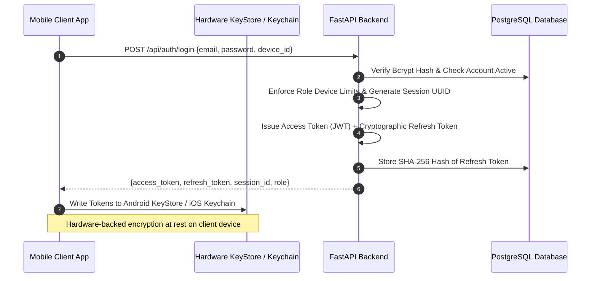
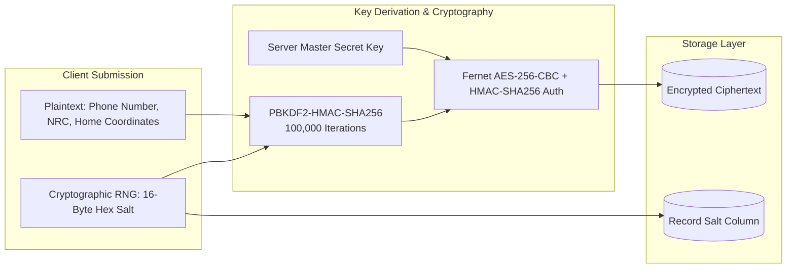
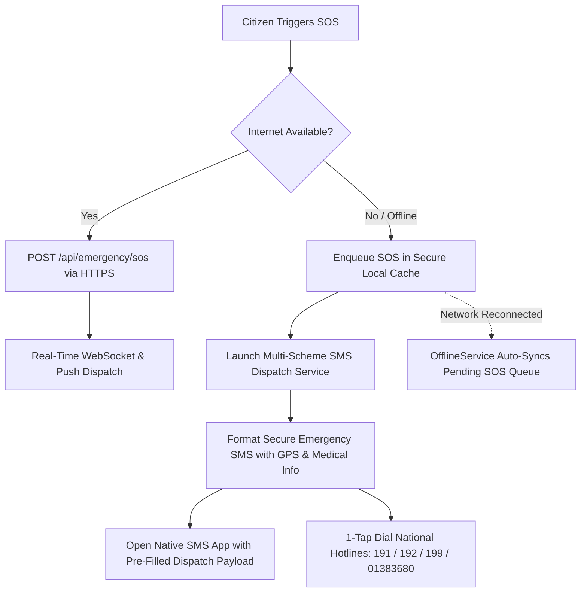

# 🛡️ Khu Nyi Kal Sal (ကူညီကယ်ဆယ်) — Client System Security Architecture

> **Document Version**: 3.0.0 (Enterprise Mission-Critical Grade)  
> **Target Audience**: Clients (Distressed Citizens, Rescue Responders, Healthcare & Rescue Organizations, System Auditors)  
> **Classification**: Mission-Critical Emergency Dispatch, Data Privacy & Life-Safety Network  
> **Primary Systems**: Cross-Platform Mobile Client (Flutter / Dart) & High-Performance Asynchronous Backend (FastAPI / PostgreSQL / Redis)  

---

## 📑 Table of Contents

1. [Executive Summary & Security Philosophy](#1-executive-summary--security-philosophy)
2. [Client Authentication & Hardware-Backed Credential Storage](#2-client-authentication--hardware-backed-credential-storage)
3. [Per-Record Salted Cryptographic Privacy (PII & Medical Protection)](#3-per-record-salted-cryptographic-privacy-pii--medical-protection)
4. [Zero-Trace Ephemeral GPS Tracking & Location Privacy](#4-zero-trace-ephemeral-gps-tracking--location-privacy)
5. [Role-Based Device Session Concurrency & Emergency Session Locking](#5-role-based-device-session-concurrency--emergency-session-locking)
6. [Transport Security & WebSocket Channel Isolation](#6-transport-security--websocket-channel-isolation)
7. [Granular Role-Based Access Control (RBAC) & Scope Isolation](#7-granular-role-based-access-control-rbac--scope-isolation)
8. [Offline Resilience, Safe Queueing & Out-of-Band SMS Fallback](#8-offline-resilience-safe-queueing--out-of-band-sms-fallback)
9. [Abuse Mitigation, Anti-Spam Engine & Instant Ban Cascade](#9-abuse-mitigation-anti-spam-engine--instant-ban-cascade)
10. [Account Recovery, One-Time Passwords (OTP) & Password Security](#10-account-recovery-one-time-passwords-otp--password-security)
11. [Client Security Recommendations & Vulnerability Disclosure](#11-client-security-recommendations--vulnerability-disclosure)

---

## 1. Executive Summary & Security Philosophy

**Khu Nyi Kal Sal (ကူညီကယ်ဆယ်)** operates in high-stress, life-critical environments across Myanmar. In emergency rescue and humanitarian dispatch, system security directly protects human lives, civil privacy, and operational integrity.

The client security framework is built on four core principles:

```
┌─────────────────────────────────────────────────────────────────────────────┐
│                       CORE CLIENT SECURITY PILLARS                          │
├──────────────────────┬──────────────────────┬───────────────────────────────┤
│   ZERO-TRACE GPS     │ SALTED PII & MEDICAL │   HARDWARE KEYSTORE SECRETS   │
│ Live coordinates are │ PII (phone, medical, │ Tokens & keys never touch     │
│ volatile & purged on │ NRC) encrypted with  │ plain storage; stored inside  │
│ mission completion.  │ 16-byte dynamic salt.│ Android Keystore/iOS Keychain.│
├──────────────────────┴──────────────────────┴───────────────────────────────┤
│                   ROLE-ENFORCED MUTUAL EXCLUSION & ISOLATION                │
│ Strict device concurrency rules, emergency session locks, and fine-grained  │
│ Role-Based Access Control (RBAC) prevent impersonation and data leakage.    │
└─────────────────────────────────────────────────────────────────────────────┘
```

---

## 2. Client Authentication & Hardware-Backed Credential Storage

The platform employs a multi-tiered token-based authentication architecture designed to prevent credential theft, replay attacks, and unauthorized session replication.



### 2.1. Hardware-Backed Secure Storage
* **Android Implementation**: Backed by `AndroidKeyStore` and `EncryptedSharedPreferences` with AES-256 encryption. Tokens never reside in plain shared preferences or unencrypted files.
* **iOS Implementation**: Backed by Apple `Keychain Services` with `kSecAttrAccessibleAfterFirstUnlock` attribute protection.
* **Self-Healing Reset-on-Error**: If device keystore integrity is compromised or corrupted during OS migration, `_safeRead` and `_safeWrite` trigger automatic secure purge and clean re-initialization to prevent application deadlocks.

### 2.2. Dual-Token Architecture
* **Short-Lived Access Tokens (JWT)**:
  * Signed with server-side HMAC-SHA256 (`HS256`).
  * Claims include Subject UUID (`sub`), Session ID (`session_id`), and Role (`role`).
  * Expiration: 15–60 minutes (reducing exposure window if intercepted).
* **High-Entropy Refresh Tokens**:
  * Generated with cryptographically secure randomness: `secrets.token_urlsafe(64)`.
  * **Database Protection**: Stored exclusively as **SHA-256 cryptographic hashes** (`hash_token()`). A database compromise does not reveal plaintext refresh tokens.
  * **Exchange Protocol**: Handled through a dedicated, isolated HTTP client (`_tokenDio`) with atomic locking to prevent infinite refresh loops and race conditions.

---

## 3. Per-Record Salted Cryptographic Privacy (PII & Medical Protection)

To protect vulnerable citizens, medical patients, and field volunteers, all Personally Identifiable Information (PII) is encrypted at rest using a multi-salt envelope encryption strategy.



### 3.1. Cryptographic Salting Specifications
* **Dynamic Record Salting**: Every user profile, organization, and volunteer record generates a unique 16-byte random salt (`secrets.token_hex(16)`).
* **Key Derivation (PBKDF2)**: Salt and master key are derived using PBKDF2 with SHA-256 across **100,000 iterations**, producing a distinct 32-byte Fernet key per database row.
* **Ciphertext Uniqueness**: Two citizens with identical phone numbers or medical conditions produce completely different ciphertexts in the database, preventing frequency analysis and rainbow table correlation.
* **Authenticated Encryption**: Uses Fernet (AES-256 in CBC mode with PKCS7 padding, coupled with HMAC-SHA256 message authentication) ensuring tamper detection.

---

## 4. Zero-Trace Ephemeral GPS Tracking & Location Privacy

Emergency response requires real-time location streaming, but persistent historical tracking poses severe civil safety risks. Khu Nyi Kal Sal implements a strict **Zero-Trace Location Policy**.

```
┌─────────────────────────────────────────────────────────────────────────────┐
│                    ZERO-TRACE GPS LIFECYCLE FOR CLIENTS                     │
├─────────────────────────────────────────────────────────────────────────────┤
│ 1. Active SOS Created   ──► Coordinates streamed to Volatile RAM / Redis    │
│ 2. Live Navigation      ──► OSRM Road Geometry rendered on client in-memory │
│ 3. Rescue Completed     ──► Instant Cryptographic Purge from Cache & Memory │
│ 4. TTL Auto-Expiry      ──► 300-Second Hard TTL prevents stale retention    │
└─────────────────────────────────────────────────────────────────────────────┘
```

### 4.1. Privacy Safeguards
1. **Volatile In-Memory Cache**: Live streaming responder and victim coordinates are kept in volatile Redis or in-memory RAM caches with an active Time-To-Live (TTL = 300s).
2. **Instant Mission Purging**: Upon completion (`COMPLETED`) or cancellation (`CANCELLED`) of an emergency, the `LocationCacheService.purge_tracking()` pipeline immediately deletes all coordinate caches for the session.
3. **Encrypted Base Location**: Persistent user coordinates (such as saved home coordinates) are encrypted with record-level salting (`encrypt_location()`), never stored as raw plain numbers.
4. **Anti-Stalking Protections**: Volunteers and organizations can only access victim location coordinates while actively assigned to an ongoing emergency mission. Once resolved, access is immediately revoked.

---

## 5. Role-Based Device Session Concurrency & Emergency Session Locking

The platform enforces strict device policies tailored to user operational risk profiles:

| Client Role | Max Concurrency | Eviction Policy | Inactivity Timeout | Threat Mitigation |
| :--- | :---: | :--- | :---: | :--- |
| **Distressed Citizen (`USER`)** | **3 Devices** | **LRU Eviction**: Oldest active session automatically logged out on 4th login. | 24 Hours | Balances multi-device convenience with credential stuffing mitigation. |
| **Emergency Volunteer (`VOLUNTEER`)** | **1 Device** | **Instant Mutual Exclusion**: All previous sessions instantly terminated. | 24 Hours | Prevents credential sharing, responder spoofing, and ghost responses. |
| **Rescue Org (`ORGANIZATION`)** | **Multi-Seat** | Supervised concurrent sessions for dispatch room workstations. | 24 Hours | Facilitates dispatch command center operations with audit logging. |
| **Super Admin (`ADMIN`)** | **Multi-Seat** | Supervised sessions with remote kill capability. | 24 Hours | Full platform oversight with instant token deactivation. |

### 5.1. 1-Tap SOS Emergency Session Lock
When a citizen triggers an emergency SOS (`POST /api/emergency/sos`), the system executes an **Emergency Session Lock**:
* Locks the active session to the victim's current handset.
* Automatically terminates all other auxiliary sessions for that account.
* Prevents simultaneous logins, conflicting status updates, or malicious interception during an active crisis.

### 5.2. Client Self-Service Session Control
Clients have full visibility into their logged-in devices via `GET /api/auth/sessions`:
* Displays device identifier, platform/model name, IP address, user-agent, and last active timestamp.
* **1-Tap Session Termination**: Revoke specific suspicious sessions via `DELETE /api/auth/sessions/{id}`.
* **Global Logout**: Terminate all active sessions across all devices instantly with `POST /api/auth/logout-all`.

---

## 6. Transport Security & WebSocket Channel Isolation

```mermaid
graph TD
    subgraph Client Application
        C1[Citizen Handset]
        C2[Volunteer Device]
        C3[Org Console]
    end

    subgraph Security Gateway
        TLS[TLS 1.3 / HTTPS & WSS]
        AUTH[JWT & Session Verification]
    end

    subgraph Isolated WebSocket Channels
        W1[Channel: user_{uuid}]
        W2[Channel: org_{uuid}]
        W3[Channel: volunteer_{uuid}]
        W4[Channel: family_{group_id}]
    end

    C1 & C2 & C3 -->|WSS Encrypted Stream| TLS
    TLS --> AUTH
    AUTH --> W1 & W2 & W3 & W4
```

### 6.1. Transport Layer Encryption
* **Strict HTTPS / WSS**: All network communication between the Flutter client and the FastAPI backend is mandated over TLS 1.3 / WSS, preventing eavesdropping and Man-in-the-Middle (MitM) attacks.
* **HTTP Connection Pooling**: Mobile client uses `Dio` with strict connection timeouts (15 seconds) to prevent Denial of Service and socket hang attacks on low-bandwidth networks.

### 6.2. WebSocket Security & Room Isolation
* **Token Handshake Verification**: Real-time WebSocket connections require explicit JWT validation prior to socket elevation.
* **Channel Segregation**: Sockets are bound strictly to user-scoped topics (`user_{id}`, `org_{id}`, `volunteer_{id}`, `family_{group_id}`).
* **Zero Cross-Talk**: Clients cannot listen to or snoop on distress feeds outside their verified role and geographical assignment.

---

## 7. Granular Role-Based Access Control (RBAC) & Scope Isolation

Backend operations are defended by the `require_role()` dependency factory, enforcing least privilege access across all client endpoints:

```
┌─────────────────────────────────────────────────────────────────────────────┐
│                      CLIENT ROLE PERMISSION MATRIX                          │
├─────────────────────────┬──────────────┬──────────────┬──────────────┬──────┤
│ Endpoint Category       │ Citizen User │ Volunteer    │ Organization │ Admin│
├─────────────────────────┼──────────────┼──────────────┼──────────────┼──────┤
│ Trigger SOS Emergency   │      ✅      │      ❌      │      ❌      │  ❌  │
│ Accept Emergency Task   │      ❌      │      ✅      │      ✅      │  ❌  │
│ Request / Donate Blood  │      ✅      │      ❌      │      ❌      │  ❌  │
│ Accept Blood Request    │      ❌      │      ❌      │      ✅      │  ❌  │
│ Family Circle Sync      │      ✅      │      ❌      │      ❌      │  ❌  │
│ Broadcast Official News │      ❌      │      ❌      │      ❌      │  ✅  │
│ Account Ban / SOS Kill  │      ❌      │      ❌      │      ❌      │  ✅  │
└─────────────────────────┴──────────────┴──────────────┴──────────────┴──────┘
```

### 7.1. Family Safety Circle Isolation
* Citizens can create and join private Family Circles protected by unique cryptographic family group identifiers.
* Family distress alerts (`FAMILY_ALERT`) and location pins are strictly isolated to authenticated circle members.

---

## 8. Offline Resilience, Safe Queueing & Out-of-Band SMS Fallback

In disaster zones where cellular towers fail or internet bandwidth is severed, client security and delivery must not fail.



### 8.1. Offline Security Features
* **Secure Local Action Queue**: Offline distress requests are stored locally in isolated storage. Once connectivity is detected via `connectivity_plus`, the queue auto-syncs securely via authenticated REST endpoints.
* **Out-of-Band SMS Payload**: When offline, the client formats a standardized distress text message with exact latitude, longitude, victim blood type, and emergency condition for dispatch via GSM SMS.
* **Direct Hotline Redirection**: Emergency hotlines (Ambulance 191, Fire 192, Police 199, Red Cross 01383680) are baked into client storage for instantaneous 1-tap failover.

---

## 9. Abuse Mitigation, Anti-Spam Engine & Instant Ban Cascade

To prevent malicious actors from sabotaging emergency rescue channels with fake requests, the system implements an automated abuse mitigation engine:

```mermaid
flowchart TD
    SOS([SOS Trigger Event]) --> CountQuery[Query 24-Hour SOS Count for User]
    CountQuery --> CheckFreq{SOS Count >= 3 in 24h?}
    
    CheckFreq -- Yes --> TagAbuse[Flag Emergency: is_suspected_abuse = True<br/>Reason: 'High Frequency: 3+ SOS in 24h']
    CheckFreq -- No --> NormalOps[Normal Emergency Two-Tier Dispatch]
    
    TagAbuse --> RadarAlert[Render High-Visibility Warning on Admin Command Radar]
    RadarAlert --> AdminDecision{Admin Review}
    
    AdminDecision -- Malicious / Spam --> BanAction[POST /api/admin/users/{id}/ban]
    BanAction --> Deactivate[Set Account is_active = False]
    Deactivate --> RevokeSessions[Deactivate ALL User Sessions]
    RevokeSessions --> TerminateSockets[Force Close Active WebSockets]
    TerminateSockets --> RejectRequests[All Incoming Client Tokens Return 403 Forbidden]
```

* **Automated Frequency Flagging**: Accounts triggering $\ge 3$ SOS requests within a 24-hour window are automatically flagged for administrative review (`is_suspected_abuse = True`).
* **Instant Session Revocation on Ban**: When an admin bans a user, `Account.is_active` is set to `False`, all active sessions are instantly revoked from the database, and existing WebSocket streams are immediately severed.
* **Immediate Token Rejection**: The `get_current_user` FastAPI dependency rejects any incoming request from deactivated accounts with `403 Forbidden`.

---

## 10. Account Recovery, One-Time Passwords (OTP) & Password Security

### 10.1. Password Hashing (Bcrypt & Truncation Defense)
* **Bcrypt with Configured Rounds**: Passwords are hashed using Passlib's `bcrypt` context.
* **72-Byte Truncation Protection**: Passwords are pre-processed and encoded to a 72-byte safe limit (`_clean_password()`), avoiding library-level crashes on Unicode characters while maintaining maximum entropy.

### 10.2. 6-Digit Email OTP Password Recovery
1. **High-Entropy Numeric OTP**: Generated using `secrets.randbelow(900000) + 100000` (cryptographically secure 6-digit number).
2. **Short Time-To-Live**: OTP codes expire after **300 seconds (5 minutes)**.
3. **Single-Use Enforcement**: Upon successful password reset, the OTP record is marked `is_used = True`, preventing replay attacks.
4. **Automatic Session Purge on Password Reset**: When a password is reset, all existing device sessions are immediately revoked (`logout_all_user_sessions()`), forcing re-authentication across all hardware handsets.

---

## 11. Client Security Recommendations & Vulnerability Disclosure

### 11.1. Recommended Client Best Practices
* **Device Lock & Biometrics**: Always configure biometric authentication (Fingerprint / Face ID) or PIN lock on devices running Khu Nyi Kal Sal.
* **Keep App Updated**: Install official app updates to ensure security patches and cryptographic routines remain current.
* **Session Audits**: Periodically review active logged-in sessions via the Settings screen and terminate unrecognized devices.
* **Never Share Credentials**: Field volunteers and organization dispatchers must never share account credentials; each staff member should maintain their own individual account.

### 11.2. Vulnerability Disclosure & Bug Reporting
If you discover a security vulnerability or privacy concern within the Khu Nyi Kal Sal client or backend systems, please contact the security team immediately:

* **Security Email**: `security@khunyikalsal.org` (or emergency developer contact)
* **Responsible Disclosure**: Please report potential vulnerabilities privately before public disclosure to protect citizens relying on the emergency network.
* **Response SLA**: The engineering team acknowledges critical vulnerability reports within 24 hours.

---

<div align="center">
  <sub>Khu Nyi Kal Sal Emergency Rescue & Humanitarian Network — Built for Resilience, Privacy & Human Life Safety.</sub>
</div>
