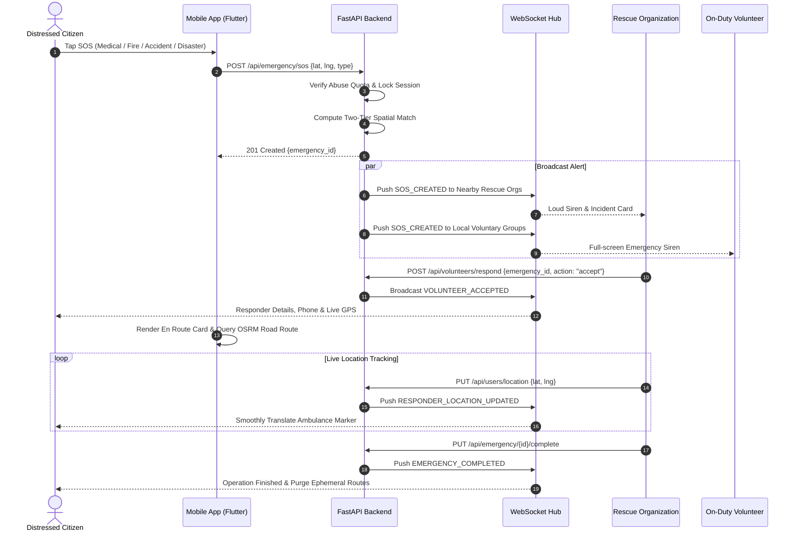
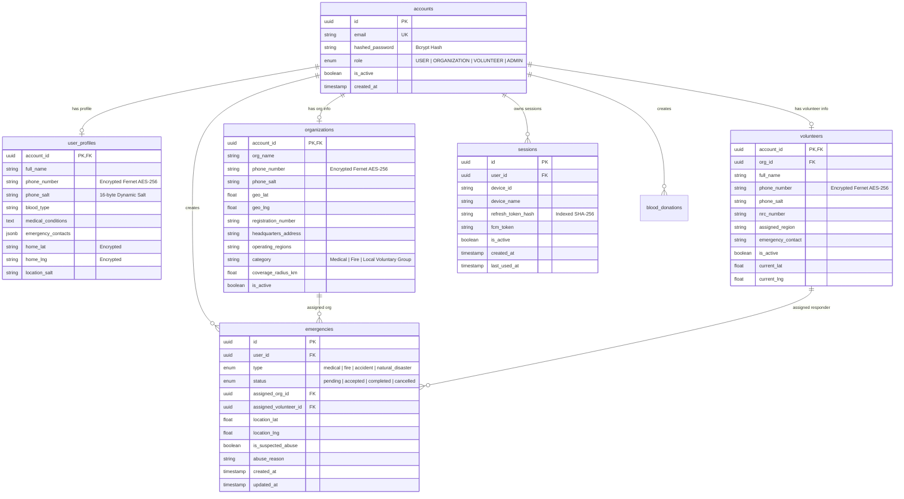

# 🚨 Khu Nyi Kal Sal (ကူညီကယ်ဆယ်) — Comprehensive System & Technical Overview

> **Application Name**: Khu Nyi Kal Sal (ကူညီကယ်ဆယ် — Rescue & Emergency Relief Network)  
> **Platform Classification**: Mission-Critical Emergency Dispatch, Blood Donation Coordination & Humanitarian Disaster Management Platform  
> **Target Region**: Myanmar (Engineered for Low-Bandwidth Resilience, Offline-First Operations, and Salted Cryptographic Privacy)  
> **Repository**: `Script-By-Lin/KhuNyiKalSal`  
> **Development Group**: CognitionX  

---

## 📑 Table of Contents

1. [Executive Summary](#1-executive-summary)
2. [Technology Stack & Frameworks Used](#2-technology-stack--frameworks-used)
3. [Data Protection & Cryptographic Security Architecture](#3-data-protection--cryptographic-security-architecture)
4. [Session Control & Multi-Device Management](#4-session-control--multi-device-management)
5. [Core Features & Functional Subsystems](#5-core-features--functional-subsystems)
6. [Offline Resilience & Fallback Dispatch Subsystem](#6-offline-resilience--fallback-dispatch-subsystem)
7. [System Workflow & Architecture Flowcharts](#7-system-workflow--architecture-flowcharts)
8. [Database Schema & Data Models](#8-database-schema--data-models)
9. [API & Real-Time Communication Protocols](#9-api--real-time-communication-protocols)
10. [Design System, Theming & Localization](#10-design-system-theming--localization)

---

## 1. Executive Summary

**Khu Nyi Kal Sal (ကူညီကယ်ဆယ်)** is a high-availability, real-time emergency dispatch and humanitarian rescue network designed specifically to address the unique infrastructural and connectivity challenges in Myanmar.

The platform bridges:
* **Distressed Citizens (Victims)**: Requesting immediate medical, fire, accident, or natural disaster assistance.
* **Verified Rescue Organizations**: Medical teams, fire departments, and local voluntary rescue associations.
* **Certified Field Volunteers**: On-duty first responders providing local, rapid-response aid.
* **Family Safety Circles**: Relatives notified instantly when a member triggers an SOS.
* **Healthcare Blood Banks & Donors**: Facilitating life-saving blood donations and emergency hospital requests.

```
                  ┌──────────────────────────────────────────────┐
                  │       KHU NYI KAL SAL RESCUE NETWORK         │
                  └──────┬──────────────┬──────────────┬─────────┘
                         │              │              │
        ┌────────────────▼───┐   ┌──────▼───────┐   ┌──▼─────────────────┐
        │  EMERGENCY SOS &   │   │ BLOOD DONOR  │   │  CIVIC SUPPORT &   │
        │ 2-TIER DISPATCH    │   │  EXCHANGE    │   │ ANNOUNCEMENTS HUB  │
        │ • Medical / Fire   │   │ • Donor Pool │   │ • Official Alerts  │
        │ • Accident/Disaster│   │ • Blood Req  │   │ • KBZ/Wave/MMQR    │
        │ • Live Road Routing│   │ • Org Match  │   │ • Abuse Prevention │
        └────────────────────┘   └──────────────┘   └────────────────────┘
```

---

## 2. Technology Stack & Frameworks Used

The application is structured into a modern client-server architecture utilizing high-performance asynchronous technologies across the mobile client, backend services, persistence layer, and mapping infrastructure.

### 📱 Frontend (Mobile Application)
* **Framework**: [Flutter](https://flutter.dev/) (SDK 3.32+ / Dart 3.12+) — Cross-platform mobile development for iOS and Android.
* **State Management**: [Riverpod](https://riverpod.dev/) (`flutter_riverpod`) — Reactive, compile-safe state management.
* **Navigation & Routing**: [GoRouter](https://pub.dev/packages/go_router) — Declarative URL-based routing supporting deep linking, sub-routes, and auth guards.
* **Network & HTTP Client**: [Dio](https://pub.dev/packages/dio) (v5.8+) — Connection pooling, interceptors for automatic Bearer token injection, and 401 token refresh retry logic.
* **Mapping & GIS**:
  * `flutter_map` (OpenStreetMap tile provider).
  * `latlong2` for spatial calculations.
  * Integration with **Open Source Routing Machine (OSRM)** for real-time drivable road geometry navigation.
* **Location Services**: `geolocator` — Hardware GPS coordinate streaming and background position updates.
* **Local Storage & Keystore**:
  * `flutter_secure_storage` — Hardware-backed encryption via Android KeyStore and iOS Keychain for JWTs and secrets.
  * `shared_preferences` — Fast local caching for offline data, app preferences, and active locale.
* **Real-time Engine**: Native WebSocket client (`web_socket_channel`) with auto-reconnection and heartbeat pings.
* **UI & Typography**: Modern Red/Black/White emergency palette, custom glassmorphic cards, Google Fonts, and Myanmar Unicode text renderers.

### ⚡ Backend (API & Dispatch Engine)
* **Runtime & Framework**: [Python 3.12](https://www.python.org/) + [FastAPI](https://fastapi.tiangolo.com/) — ASGI asynchronous framework offering high concurrency and low latency.
* **Async Server**: [Uvicorn](https://www.uvicorn.org/) — ASGI worker server.
* **Data Validation & Serialization**: [Pydantic v2](https://docs.pydantic.dev/) — Strict schema validation, request/response models.
* **ORM & Database Driver**: [SQLAlchemy 2.0 (Async)](https://www.sqlalchemy.org/) paired with `asyncpg` for PostgreSQL connection pooling.
* **Real-Time Communication**: FastAPI WebSockets with custom multi-device session connection manager (`WebSocketManager`).
* **Authentication**:
  * `python-jose` (JSON Web Tokens - JWT with short TTL).
  * `passlib` with `bcrypt` (Blowfish-based salted password hashing).
  * SHA-256 for token hashing and session index lookups.

### 🗄️ Database & Ephemeral Storage
* **Primary Relational Database**: [PostgreSQL 16](https://www.postgresql.org/) (Railway Cloud Deployment / Docker container).
  * Configured with async connection pooling (`pool_size=15`, `max_overflow=25`, `pool_recycle=300`, `pool_pre_ping=True`).
  * Self-healing indexes on composite fields: `(user_id, created_at)` for SOS abuse check, `(is_pinned, created_at)` for bulletins.
* **Ephemeral Cache**: In-Memory RAM Cache & Redis for active responder GPS streams, live route coordinates, and temporary tracking data.
* **Development Database**: SQLite (`aiosqlite`) fallback for local automated testing and mocking.

### 🚀 DevOps & Infrastructure
* **Containerization**: Docker & Docker Compose (`docker-compose.yml`).
* **Cloud Platform**: [Railway](https://railway.app/) for backend API and managed PostgreSQL hosting.
* **Mapping Servers**: OpenStreetMap public tile servers and OSRM routing endpoints.

---

## 3. Data Protection & Cryptographic Security Architecture

To protect citizens and responders—especially in vulnerable regions—Khu Nyi Kal Sal implements defense-in-depth security and cryptographic privacy across all layers:

```
┌─────────────────────────────────────────────────────────────────────────────┐
│                   CRYPTOGRAPHIC PRIVACY ENGINE OVERVIEW                     │
├─────────────────────────────────────────────────────────────────────────────┤
│  1. Ingestion: Plaintext PII + 16-byte Dynamic Salt (secrets.token_hex)     │
│  2. Key Derivation: PBKDF2-HMAC-SHA256 (100,000 Iterations) + Master Key   │
│  3. Cipher Engine: Fernet AES-256-CBC with HMAC-SHA256 Authenticated Tag   │
│  4. Storage: Ciphertext and Unique Salt stored in separate columns          │
│  5. Ephemeral Tracking: Live GPS coordinates held strictly in RAM/TTL cache │
└─────────────────────────────────────────────────────────────────────────────┘
```

### 3.1. Salted Fernet AES-256 Encryption for PII
* **Per-Record Dynamic Salting**: Every sensitive record (phone number, home address, medical condition, emergency contact) is generated with a cryptographically unique 16-byte random salt (`secrets.token_hex(16)`).
* **Key Derivation Function (KDF)**: Derives a 32-byte URL-safe base64-encoded key using `PBKDF2HMAC` (SHA-256 algorithm, 100,000 iterations) combined with the server's master secret key.
* **Zero Pattern Leakage**: Because every record uses a distinct salt, two users having identical phone numbers will produce completely different ciphertexts in the database, preventing frequency analysis and rainbow-table attacks.
* **Encrypted Fields in Database**:
  * `user_profiles.phone_number` & `phone_salt`
  * `user_profiles.home_lat`, `user_profiles.home_lng` & `location_salt`
  * `organizations.phone_number` & `phone_salt`
  * `volunteers.phone_number` & `phone_salt`
  * `blood_donations.phone_number` & `phone_salt`

### 3.2. Zero-Trace Ephemeral GPS Tracking
* **No Persistent Movement History**: Unlike commercial ride-hailing apps, Khu Nyi Kal Sal does not permanently store route histories or movement logs in the database.
* **Volatile RAM/TTL Storage**: High-frequency coordinates transmitted by moving ambulances and volunteers are kept only in volatile RAM/Redis cache.
* **Instant Cryptographic Purge**: When an emergency status transitions to `completed` or `cancelled`, the ephemeral tracking channels and route caches are immediately wiped from memory.

### 3.3. Secure Password & Credential Hashing
* **Bcrypt Password Protection**: Passwords are never stored in plaintext. They are processed through `passlib.context.CryptContext` using `bcrypt` with automatic salting and 72-byte truncation safety guards.
* **Refresh Token Hashing**: Refresh tokens are generated as 64-character secure random strings (`secrets.token_urlsafe(64)`). The backend stores only the `SHA-256` hash in the database, rendering stolen database dumps useless for session hijacking.

### 3.4. Hardware-Backed Client-Side Storage
* The mobile frontend uses `flutter_secure_storage`:
  * **Android**: Secured with Android KeyStore using AES cipher encryption.
  * **iOS**: Stored in Keychain protected with Secure Enclave hardware.
* Tokens (`access_token`, `refresh_token`, `device_id`, `session_id`) are never exposed in unencrypted SharedPreferences or standard files.

---

## 4. Session Control & Multi-Device Management

To prevent duplicate emergency dispatching, combat rogue logins, and support emergency room command centers, the system implements a strict role-based session control policy:

| Role | Maximum Devices | Session Eviction Policy | Inactivity Expiration | Purpose |
| :--- | :---: | :--- | :---: | :--- |
| **USER (Citizen)** | **3 Devices** | **LRU Eviction**: Oldest device is logged out automatically when logging in on a 4th device. | 24 Hours | Convenience across personal phones/tablets. |
| **VOLUNTEER** | **1 Device** | **Instant Mutual Exclusion**: All previous active sessions are terminated upon new login. | 24 Hours | Prevents duplicate SOS acceptances and conflicting responder telemetry. |
| **ORGANIZATION** | **Unlimited** | Multi-workstation access enabled for dispatch command rooms. | 24 Hours | Allows multiple dispatchers to operate on the same organization account. |
| **ADMIN** | **Unlimited** | Protected with role validation, session tracking, and remote session termination. | 24 Hours | System management and live monitoring. |

### Emergency Session Locking
When a citizen triggers an SOS:
* The active emergency locks to the current `session_id`.
* Conflicting sessions are temporarily restricted from modifying the emergency state to guarantee operational integrity.

### Session Write Throttling
To prevent database write saturation during high-frequency API calls or WebSocket streaming, the `last_used_at` session timestamp is updated in the database only once every **5 minutes** per active device.

---

## 5. Core Features & Functional Subsystems

### 🔴 1. Multi-Category 1-Tap SOS Distress Engine
* **Emergency Categories**: Medical, Fire, Accident, and Natural Disaster.
* **One-Tap Trigger**: Captures current GPS coordinates, locks the session, tags emergency details (blood type, pre-existing medical conditions), and broadcasts within sub-second latency.
* **Audio-Visual Siren**: Automatically plays a high-decibel emergency siren and triggers vibration on nearby responder devices.

### 🗺️ 2. Two-Tier Spatial Dispatch & Real Road Routing
* **Tier 1 (Specialized Units)**: Medical emergencies route first to nearby Medical Rescue Teams / Ambulances; Fire emergencies route directly to Fire Stations.
* **Tier 2 (Local Voluntary Groups Cascade)**: If specialized units are occupied or during major disasters, alerts dual-broadcast to certified Local Voluntary Groups.
* **OSRM Road Geometry**: Rather than simple straight-line markers, the app computes and renders real drivable turn-by-turn road geometry on OpenStreetMap.
* **Live Responder Tracking**: Smooth marker interpolation as the ambulance approaches the distress location.

### 🩸 3. Blood Donation Hub & Emergency Blood Exchange
* **Donate Blood (လှူဒါန်းရန်)**: Citizens register their blood type, availability, and preferred regions.
* **Request Blood (တောင်းခံရန်)**: Patients in critical hospital conditions submit emergency blood requests with required unit counts and urgency levels.
* **Organization Fulfillment**: Verified Medical Organizations review pending requests, accept them, and schedule specific appointment times and hospital locations.

### 🛡️ 4. Abuse Detection & Automated Mitigation Engine
* **24-Hour Rate Limiting**: The backend automatically tracks SOS invocation frequency. If an account issues 3 or more SOS requests within 24 hours (`sos_count_24h >= 3`), the record is flagged as `is_suspected_abuse = True`.
* **Admin Radar Highlight**: Suspected abuse records are highlighted with distinct purple warning cards on the Super Admin Live Radar.
* **Instant Banning & Force Cancellation**:
  * Super Admins can force-cancel abusive alerts via `/api/admin/emergencies/{id}/cancel`.
  * Malicious actors can be banned with one tap (`POST /api/admin/users/{id}/ban`), instantly setting `is_active = False`, revoking all active JWT sessions, and terminating active WebSockets.

### 👨‍👩‍👧 5. Family Safety Circles & Emergency Cascade
* Users can link emergency contacts and family member accounts.
* When an SOS is triggered, linked family members receive high-priority alert cards and map coordinates.

### 📢 6. Official Announcements & Civic Alerts
* Super Admins broadcast verified news categorized into `Urgent`, `Weather/Disaster`, `Blood Drive`, and `General`.
* Features pinned bulletin boards highlighted at the top of all user mobile feeds.

### 💳 7. Support Us & Multi-Channel Humanitarian Donations
* Admin-configurable donation channels supporting **KBZPay**, **WavePay**, **Bank Transfers (KBZ, AYA, CB)**, and national **MMQR Standard Payloads**.
* 1-tap clipboard copying for fast civic contributions.

---

## 6. Offline Resilience & Fallback Dispatch Subsystem

Given that mobile network connectivity in Myanmar can be disrupted during disasters or in remote areas, Khu Nyi Kal Sal includes comprehensive offline-first capabilities:

```
┌─────────────────────────────────────────────────────────────────────────────┐
│                       OFFLINE SOS DISPATCH ENGINE                           │
├─────────────────────────────────────────────────────────────────────────────┤
│  1. Online Connection Present? ──► [Yes] ──► FastAPI REST / WebSocket Hub   │
│                                ──► [No]                                     │
│  2. Read Cached User Profile & Local Rescue Organization Phone Cache        │
│  3. Construct Formatted SMS with GPS Lat/Lng & Google Maps Link             │
│  4. Dispatch SMS Cascade:                                                   │
│     • Primary: Direct SMS intent with query payload                         │
│     • Fallback 1: Encoded sms: URI scheme                                   │
│     • Fallback 2: smsto: scheme (Optimized for Xiaomi / Oppo / Samsung)     │
│     • National Hotlines Fallback: Fire (192), Ambulance (191), Police (199) │
│  5. Offline First-Aid Knowledge Base accessible without internet            │
└─────────────────────────────────────────────────────────────────────────────┘
```

* **Offline First-Aid Guide**: Complete emergency medical handbook (CPR, burn treatment, severe bleeding management, fracture stabilization) bundled locally within the app.
* **Cached Emergency Contacts & Orgs**: Local storage caches the nearest rescue organization phone numbers for offline calling and SMS dispatch.

---

## 7. System Workflow & Architecture Flowcharts

### 7.1. Layered System Architecture

```mermaid
graph TD
    subgraph Mobile Client Layer (Flutter)
        A[Citizen App]
        B[Volunteer Handset]
        C[Organization HQ Console]
        D[Super Admin Command Center]
    end

    subgraph Gateway & Communication
        GW[FastAPI REST Gateway]
        WS[Multi-Device WebSocket Hub]
        SMS[Offline SMS Dispatch Service]
    end

    subgraph Core Business Services
        SOS[SOS Emergency Service]
        ROUT[Two-Tier Spatial Haversine Engine]
        BLOOD[Blood Donation & Request Hub]
        AUTH[Session & Token Auth Controller]
        ABUSE[Abuse Detection & Ban Engine]
        PRIV[Salted Fernet AES-256 Privacy Engine]
    end

    subgraph Persistence & Infrastructure
        DB[(PostgreSQL 16 Database)]
        CACHE[(Ephemeral RAM / Redis Cache)]
        OSRM[OpenStreetMap OSRM Routing Engine]
    end

    A & B & C & D -->|HTTPS REST| GW
    A & B & C & D -->|WSS Sockets| WS
    A -.->|No Internet| SMS
    GW --> AUTH & SOS & ROUT & BLOOD & ABUSE
    SOS --> WS & CACHE & DB
    ROUT --> OSRM & CACHE
    BLOOD --> WS & DB
    AUTH --> PRIV & DB
    ABUSE --> DB & WS
```

### 7.2. End-to-End Emergency SOS Sequence



---

## 8. Database Schema & Data Models

The relational database is structured into normalized entities with role-specific profile isolation:



---

## 9. API & Real-Time Communication Protocols

### 9.1. Key REST Endpoints

| Category | Method | Endpoint | Description | Auth Required |
| :--- | :--- | :--- | :--- | :---: |
| **Auth** | `POST` | `/api/auth/register` | Register citizen or organization | No |
| | `POST` | `/api/auth/login` | Login, enforce device limit, issue JWT | No |
| | `POST` | `/api/auth/refresh` | Rotate refresh token, issue new access token | No |
| | `POST` | `/api/auth/logout` | Deactivate session and purge token | Yes |
| **Emergency** | `POST` | `/api/emergency/sos` | Trigger 1-Tap SOS dispatch | Yes |
| | `GET` | `/api/emergency/active` | Get current active emergency | Yes |
| | `PUT` | `/api/emergency/{id}/complete` | Complete emergency and wipe route cache | Yes (Org/Admin) |
| | `PUT` | `/api/emergency/{id}/cancel` | Cancel emergency and notify responders | Yes |
| **Blood Hub** | `POST` | `/api/blood-donations` | Submit blood donation or patient request | Yes |
| | `GET` | `/api/blood-donations/all` | Query active blood donation requests | Yes |
| | `PUT` | `/api/blood-donations/{id}/accept` | Organization accepts blood request | Yes (Org) |
| **Admin** | `GET` | `/api/admin/emergencies` | Live SOS radar feed with abuse flags | Yes (Admin) |
| | `POST` | `/api/admin/emergencies/{id}/cancel`| Force-cancel false alarm alert | Yes (Admin) |
| | `POST` | `/api/admin/users/{id}/ban` | Ban malicious user & kill all sessions | Yes (Admin) |

### 9.2. Real-Time WebSocket Events
* `SOS_CREATED`: Broadcasted instantly when a citizen presses SOS.
* `VOLUNTEER_ACCEPTED`: Pushed to victim when an ambulance/responder accepts the dispatch.
* `RESPONDER_LOCATION_UPDATED`: Broadcasts live responder coordinates for real-time map tracking.
* `EMERGENCY_COMPLETED`: Signals mission resolution and triggers map cleanup.
* `NEW_ANNOUNCEMENT`: Broadcasts new emergency bulletins to all connected clients.

---

## 10. Design System, Theming & Localization

* **Color Palette**: High-contrast, accessibility-first theme engineered for emergency visibility:
  * Primary Red (`#E53935` / `#D32F2F`) for emergency actions, SOS alerts, and siren banners.
  * Deep Dark Mode (`#121212` / `#1E1E1E`) and Clean Light Mode (`#F8F9FA` / `#FFFFFF`).
  * Emerald Green (`#2E7D32`) for accepted dispatches, active status, and donor confirmations.
* **Bilingual Localization**: Seamless runtime switching between **English** and **Myanmar Unicode (Burmese)** across all screens, modals, validation messages, and emergency instructions.
* **Adaptive Role Views**: Dynamically modifies dashboards, navigation routes, and profile forms according to the logged-in role (`USER`, `ORGANIZATION`, `VOLUNTEER`, `ADMIN`).

---

*Authored by the Google DeepMind & Antigravity Engineering Teams for the Khu Nyi Kal Sal Emergency Response Network.*
