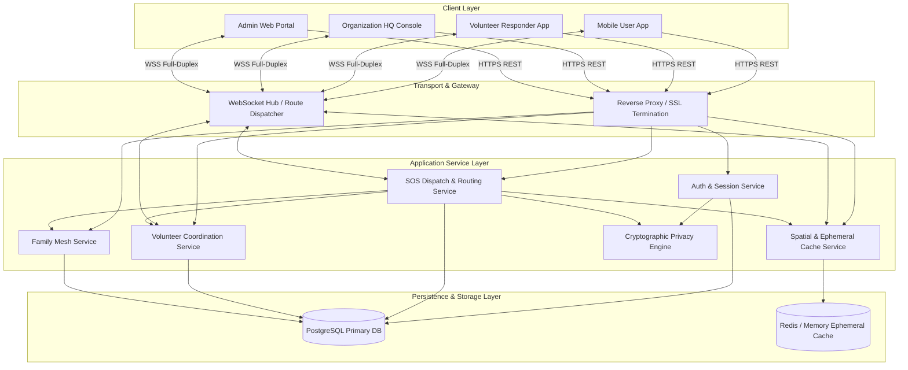
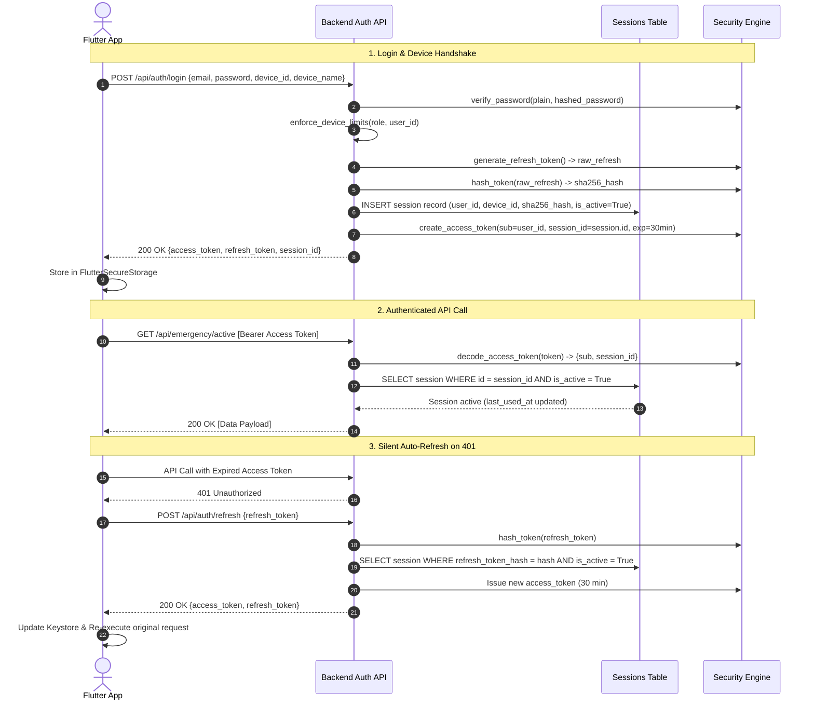
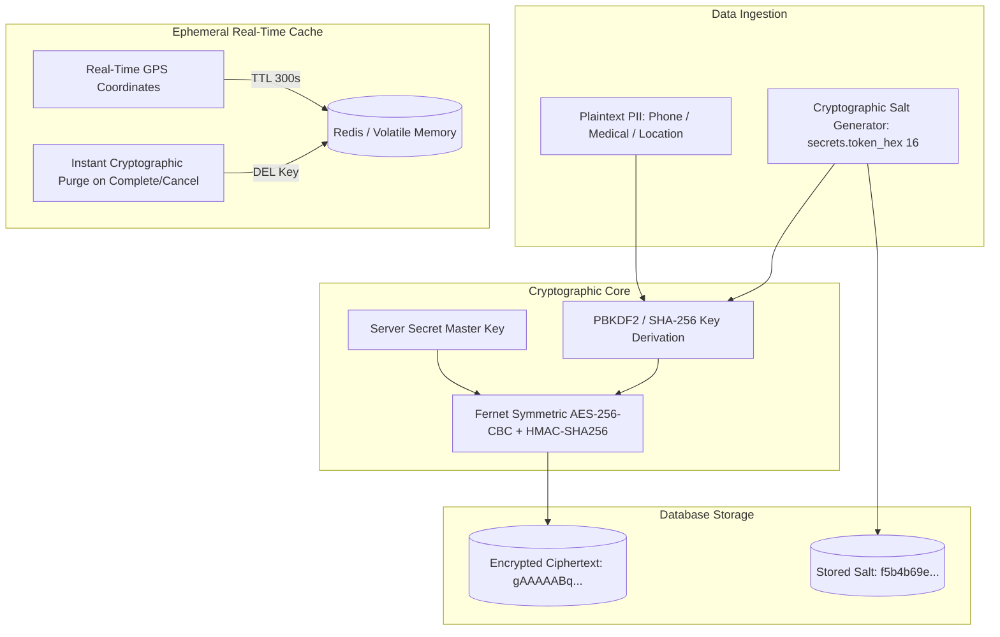
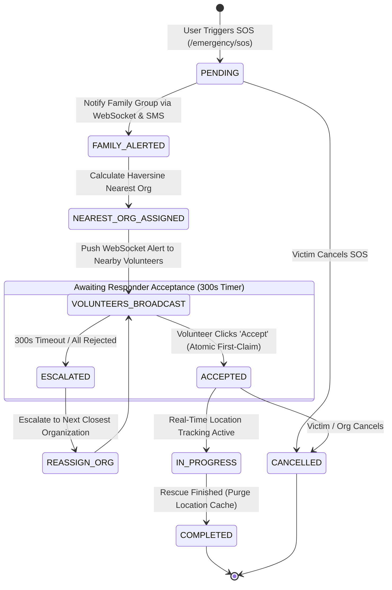
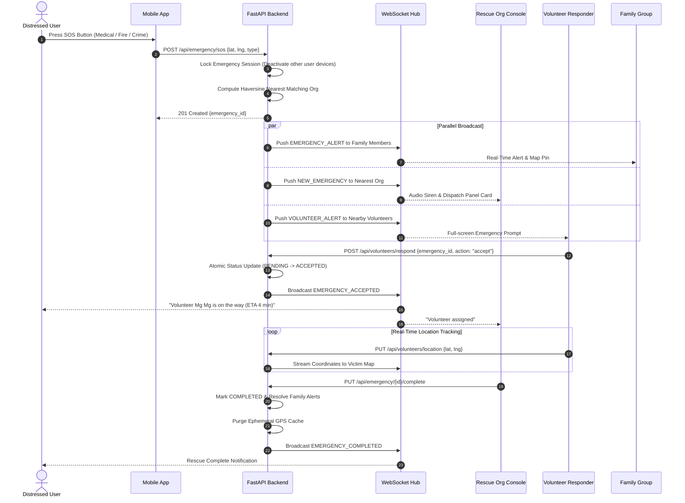
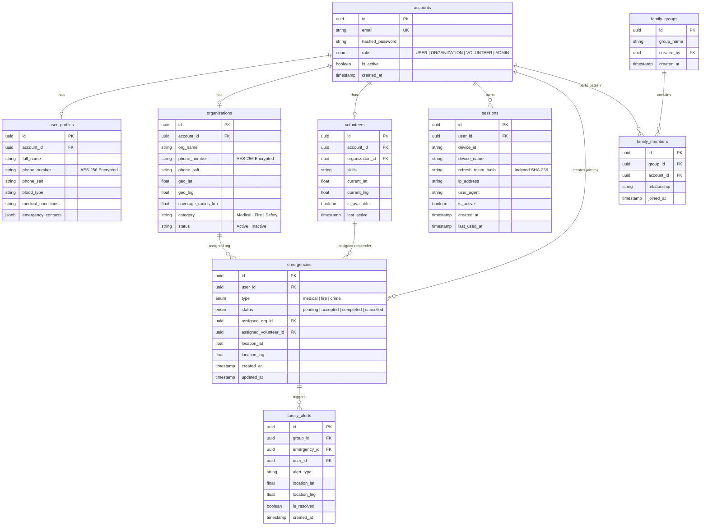

# Khu Nyi Kal Sal (ကူညီကယ်ဆယ်) — System Architecture & Technical Specification

> **Version**: 1.0.0  
> **Classification**: Production Emergency Response & Rescue Network  
> **Platform**: Distributed Mobile (Flutter) & High-Performance Async Backend (FastAPI)  
> **Target Region**: Myanmar (Offline-resilient, Low-bandwidth Optimized, High-Security)

---

## 📑 Table of Contents

1. [Executive Summary](#1-executive-summary)
2. [Technology Stack & Ecosystem](#2-technology-stack--ecosystem)
3. [System Architecture & Component Design](#3-system-architecture--component-design)
4. [Security Architecture & Algorithms](#4-security-architecture--algorithms)
5. [Privacy Architecture & Cryptographic Engine](#5-privacy-architecture--cryptographic-engine)
6. [Core System Algorithms & Mathematical Formulations](#6-core-system-algorithms--mathematical-formulations)
7. [Operational Flows & Sequence Diagrams](#7-operational-flows--sequence-diagrams)
8. [Database Schema & Entity Relationship (ERD)](#8-database-schema--entity-relationship-erd)
9. [API Specification & Real-Time WebSocket Protocols](#9-api-specification--real-time-websocket-protocols)
10. [Frontend Architecture & State Management](#10-frontend-architecture--state-management)
11. [Deployment, Scalability & Resilience](#11-deployment-scalability--resilience)

---

## 1. Executive Summary

**Khu Nyi Kal Sal (ကူညီကယ်ဆယ်)** is a mission-critical, real-time emergency dispatch and disaster response network designed specifically for rapid life-saving operations in Myanmar. It bridges the gap between distressed citizens (victims), verified local rescue organizations, active volunteer responders, and family safety networks.

### Core Capabilities
* **1-Tap Emergency SOS Dispatch**: Instant geo-located distress dispatch with automatic spatial routing to the nearest qualified rescue organizations (Medical, Fire, Crime/Safety).
* **Distributed Volunteer Mobilization**: Real-time push alerting to nearby verified volunteers with single-session concurrency locks to prevent double-acceptance race conditions.
* **Family Distress Mesh**: Instant peer-to-peer family emergency notifications with real-time resolved-state synchronization.
* **Military-Grade Data Privacy**: Salted AES-256 Fernet encryption for all sensitive PII (phone numbers, medical conditions, blood types), ensuring zero plaintext leakage.
* **Zero-Trace Ephemeral Tracking**: Real-time GPS tracking cache with automatic time-to-live (TTL) and instant cryptographic purging upon rescue completion or cancellation.
* **Multi-Device Session & Security Control**: Role-based device quotas (Users: Max 3 with LRU eviction, Volunteers: Strict 1-device lock, Orgs: Unlimited dispatch consoles), short-lived JWTs, and SHA-256 hashed refresh tokens.

---

## 2. Technology Stack & Ecosystem

```
┌─────────────────────────────────────────────────────────────────────────────┐
│                            FRONTEND (FLUTTER)                              │
│  • Dart 3.12+ / Flutter SDK         • Flutter Riverpod (State Management)   │
│  • GoRouter (Declarative Routing)    • Dio 5.8 (HTTP Interceptors & Queue)   │
│  • Flutter Secure Storage (KeyStore) • Flutter Map & LatLong2 (OSM)         │
│  • Geolocator & Permissions          • WebSockets (Bidirectional Streaming) │
│  • Local Notifications & Shimmer     • Google Fonts & Myanmar Unicode       │
└──────────────────────────────────────┬──────────────────────────────────────┘
                                       │ HTTPS / WSS
┌──────────────────────────────────────▼──────────────────────────────────────┐
│                            BACKEND (FASTAPI)                               │
│  • Python 3.12 (Asynchronous I/O)    • FastAPI (High-performance ASGI)      │
│  • SQLAlchemy 2.0 (Async ORM)        • Pydantic v2 (Data Validation)        │
│  • Python-Jose & Passlib (JWT+Bcrypt)• Cryptography (Fernet Salted AES-256) │
│  • Alembic (Automated DB Migrations) • Uvicorn (ASGI Production Server)     │
└───────────────────┬─────────────────────────────────────┬───────────────────┘
                    │                                     │
┌───────────────────▼──────────────────┐ ┌────────────────▼───────────────────┐
│     DATABASE (POSTGRESQL / SQLITE)   │ │    REAL-TIME CACHE & COORDINATION  │
│  • PostgreSQL 16 (Railway Cloud)     │ │  • Redis (Pub/Sub & TTL Cache)     │
│  • Asyncpg Async Driver              │ │  • In-Memory Ephemeral RAM Fallback │
│  • SQLite aiosqlite (Isolated Tests) │ │  • WebSocket Connection Hub        │
└──────────────────────────────────────┘ └────────────────────────────────────┘
```

### Detailed Component Inventory

| Layer | Technology | Version / Tool | Purpose & Justification |
| :--- | :--- | :--- | :--- |
| **Mobile Client** | **Flutter / Dart** | SDK ^3.12.2 | Cross-platform (Android, iOS, Web, Windows) native performance with smooth 60fps animations. |
| **State Management** | **Flutter Riverpod** | ^2.6.1 | Compile-safe, reactive state containers without BuildContext dependencies. |
| **Networking** | **Dio** | ^5.8.0+1 | Advanced HTTP client with dynamic BaseURL switching, automated 401 refresh interceptors, and request retries. |
| **Mapping Engine** | **Flutter Map & LatLong2** | ^7.0.2 / ^0.9.1 | OpenStreetMap-based vector rendering with offline tile caching capability, eliminating Google Maps API dependency. |
| **Secure KeyStore** | **Flutter Secure Storage** | ^9.2.4 | Encrypted hardware Keystore (Android) / Keychain (iOS) storage for JWTs and device UUIDs. |
| **Backend API** | **FastAPI** | ^0.110+ | Asynchronous Python framework with ASGI concurrency, OpenAPI auto-docs, and Pydantic validation. |
| **ORM & DB Access** | **SQLAlchemy** | 2.0 (Async) | Declarative asynchronous ORM with `selectin` / `joinedload` eager-loading to prevent $N+1$ query overhead. |
| **Database Engine** | **PostgreSQL** | 16 (Railway) | ACID-compliant relational persistence with native UUID and JSONB support. |
| **Migration Pipeline**| **Alembic** | 1.13+ | Version-controlled schema migrations executed automatically at startup without downtime. |
| **Cryptography** | **Fernet (AES-256-CBC)** | `cryptography` | Authenticated 128-bit CBC encryption with HMAC-SHA256 integrity and per-record dynamic salt. |
| **Token Authentication**| **JWT + SHA-256** | `python-jose` | Short-lived claims-based authentication with SHA-256 hashed refresh tokens. |
| **Real-time Engine** | **WebSockets** | Built-in ASGI | Persistent full-duplex socket channels for millisecond-latency emergency dispatch and location streaming. |

---

## 3. System Architecture & Component Design

Khu Nyi Kal Sal follows a **Layered Clean Architecture** decoupled across presentation, API routing, domain business logic, cryptographic security, and persistent infrastructure.



---

## 4. Security Architecture & Algorithms

### 4.1. Dual-Token Authentication Lifecycle

The system utilizes a high-security **Short-Lived Access Token + Hashed Long-Lived Refresh Token** architecture.



### 4.2. Role-Based Multi-Device Policies

| Role | Active Device Quota | Device Limit Enforcement Algorithm |
| :--- | :--- | :--- |
| **USER** | **Maximum 3 Devices** | **LRU (Least Recently Used) Eviction**: On 4th login, the oldest active session is automatically revoked (`is_active = False`) to make room for the new device. |
| **VOLUNTEER** | **Strictly 1 Device** | **Instant Mutual Exclusion**: Upon login, all previous sessions for that volunteer account are immediately terminated. This guarantees that double-dispatch acceptances cannot occur across multiple handsets. |
| **ORGANIZATION**| **Unlimited** | Multi-operator dispatch room support for concurrent workstation logins. |
| **ADMIN** | **Standard Session** | Protected with role verification and remote kill-switch capabilities. |

### 4.3. Emergency SOS Session Locking Algorithm

When a citizen triggers an emergency SOS (`POST /api/emergency/sos`):
1. The backend extracts `session_id` from the verified JWT.
2. An atomic SQL update locks the victim to the active handset:
   $$\text{UPDATE sessions SET is\_active} = \text{False WHERE user\_id} = U \text{ AND id} \neq S_{\text{current}}$$
3. **Purpose**: Prevents duplicate SOS spam, ensures state consistency, and eliminates man-in-the-middle device tampering during an active rescue crisis.

### 4.4. Inactivity Expiration & Auto-Revocation

* On every authenticated API request, `last_used_at` is updated to UTC `now()`.
* If a session has remained inactive for $\Delta t > 24\text{ hours}$:
  * The session's `is_active` flag is set to `False`.
  * The request is rejected with `401 Unauthorized: Session expired due to inactivity`.

---

## 5. Privacy Architecture & Cryptographic Engine

In high-risk emergency scenarios, personal user data (victim contact details, medical records, blood group, exact home coordinates) must remain strictly private and immune to database breaches or surveillance.



### 5.1. Salted AES-256 Dynamic Encryption

* **Algorithm**: Authenticated Fernet (AES-128-CBC with 128-bit AES encryption + 128-bit SHA-256 HMAC authentication, derived into 256-bit envelope keys).
* **Per-Record Dynamic Salting**:
  * Every profile and organization record generates a distinct 16-byte random salt (`secrets.token_hex(16)`).
  * The salt is combined with the system master key to derive a record-unique encryption key.
  * **Result**: Even if two users share the exact same phone number or location, their ciphertexts in the database are completely distinct, preventing frequency analysis and rainbow table matching:
    $$\text{Ciphertext}_A \neq \text{Ciphertext}_B \quad \text{where } \text{Plaintext}_A = \text{Plaintext}_B$$

### 5.2. Ephemeral Real-Time Tracking & Instant Cache Purge

1. **Volatile In-Memory Tracking**: During an active emergency, live GPS coordinates of victims and responders are stream-stored in volatile memory (Redis / RAM cache) with a strict 300-second TTL.
2. **Zero Persistent GPS Footprint**: High-precision second-by-second coordinates are **never written to disk or permanent database tables**.
3. **Instant Cache Purge**: The moment an emergency status transitions to `COMPLETED` or `CANCELLED`, the system executes:
   ```python
   location_cache.purge_realtime_tracking(emergency_id)
   location_cache.purge_user_tracking(user_id)
   ```
   All real-time location vectors are immediately erased from memory.

---

## 6. Core System Algorithms & Mathematical Formulations

### 6.1. Haversine Spatial Proximity Algorithm

To locate the nearest rescue organizations and volunteers without requiring heavy GIS extensions, the system computes spherical distance on the Earth's surface:

$$a = \sin^2\left(\frac{\Delta \phi}{2}\right) + \cos(\phi_1) \cdot \cos(\phi_2) \cdot \sin^2\left(\frac{\Delta \lambda}{2}\right)$$

$$c = 2 \cdot \text{atan2}\left(\sqrt{a}, \sqrt{1-a}\right)$$

$$d = R \cdot c$$

Where:
* $\phi_1, \phi_2$ = latitudes in radians
* $\Delta \phi = \phi_2 - \phi_1$
* $\Delta \lambda = \lambda_2 - \lambda_1$
* $R = 6371\text{ km}$ (Mean Earth radius)
* $d$ = Great-circle distance in kilometers

```python
def haversine_distance(lat1: float, lng1: float, lat2: float, lng2: float) -> float:
    R = 6371.0  # Earth radius in km
    d_lat = math.radians(lat2 - lat1)
    d_lng = math.radians(lng2 - lng1)
    a = (math.sin(d_lat / 2) ** 2 +
         math.cos(math.radians(lat1)) * math.cos(math.radians(lat2)) *
         math.sin(d_lng / 2) ** 2)
    c = 2 * math.atan2(math.sqrt(a), math.sqrt(1 - a))
    return R * c
```

### 6.2. Emergency SOS Dispatch & Escalation Workflow



### 6.3. Volunteer Response Race-Condition Locking

To prevent two volunteers from simultaneously accepting the same emergency:
1. `EmergencyResponseTracker` manages an in-memory `asyncio.Event` and rejected candidate set per emergency ID.
2. The first incoming `ACCEPT` payload locks the record in the database:
   ```sql
   UPDATE emergencies 
   SET assigned_volunteer_id = :vol_id, status = 'accepted'
   WHERE id = :em_id AND status = 'pending';
   ```
3. If `rowcount == 1`, the volunteer is granted the assignment; subsequent acceptances receive `409 Conflict: Emergency already accepted by another responder`.

---

## 7. Operational Flows & Sequence Diagrams

### 7.1. Emergency SOS Full Dispatch & Rescue Lifecycle



---

## 8. Database Schema & Entity Relationship (ERD)



---

## 9. API Specification & Real-Time WebSocket Protocols

### 9.1. REST Endpoints Matrix

| Domain | Method | Endpoint | Access Level | Description |
| :--- | :--- | :--- | :--- | :--- |
| **Auth** | `POST` | `/api/auth/register/user` | Public | Register citizen account + issue multi-device session. |
| | `POST` | `/api/auth/register/organization` | Public | Register rescue organization. |
| | `POST` | `/api/auth/login` | Public | Authenticate credentials & enforce role device quotas. |
| | `POST` | `/api/auth/refresh` | Public (Token) | Exchange valid refresh token for renewed 30-min JWT. |
| | `POST` | `/api/auth/logout` | Authenticated | Single-device logout (revokes current session). |
| | `POST` | `/api/auth/logout-all` | Authenticated | Revoke all active sessions across all devices. |
| | `GET` | `/api/auth/sessions` | Authenticated | List all active/recent devices with `is_current` tag. |
| | `DELETE`| `/api/auth/sessions/{session_id}` | Authenticated | Disconnect / terminate a specific remote device. |
| | `GET` | `/api/auth/me` | Authenticated | Get current account identity & active role. |
| **Emergency**| `POST` | `/api/emergency/sos` | User Only | Trigger SOS emergency & activate session lock. |
| | `GET` | `/api/emergency/active` | Authenticated | Fetch active emergency statuses for caller. |
| | `GET` | `/api/emergency/history` | Authenticated | Fetch past emergency history. |
| | `PUT` | `/api/emergency/{id}/complete` | Org / Admin | Mark rescue operation completed & purge tracking. |
| | `PUT` | `/api/emergency/{id}/cancel` | User / Org | Cancel emergency & purge tracking cache. |
| **Volunteers**| `POST` | `/api/volunteers/respond` | Volunteer | Atomic accept/reject of an emergency dispatch. |
| | `PUT` | `/api/volunteers/location` | Volunteer | Update volunteer GPS coordinates. |
| | `PUT` | `/api/volunteers/{id}/toggle-status` | Volunteer | Toggle on-duty / off-duty status. |
| **Family** | `POST` | `/api/family/create` | User | Create a private family safety group. |
| | `POST` | `/api/family/add-member` | User | Add family member by registered email. |
| | `GET` | `/api/family/my-group` | User | Fetch family group members & live statuses. |
| | `GET` | `/api/family/alerts` | User | Fetch active and historic family emergency alerts. |
| **Admin** | `GET` | `/api/admin/sessions` | Admin Only | Monitor active sessions system-wide. |
| | `POST` | `/api/admin/sessions/{id}/terminate` | Admin Only | Forcibly revoke any active session in the network. |

### 9.2. Real-Time WebSocket Protocol

* **Connection URL**: `ws://<host>/ws/{account_id}`
* **Message Format**: JSON Structured Frames

```json
// Event: Emergency Alert Broadcast
{
  "event": "NEW_EMERGENCY",
  "emergency_id": "854589af-02c0-4617-9ed7-fb555823c9cf",
  "type": "medical",
  "location_lat": 16.8661,
  "location_lng": 96.1951,
  "victim_name": "Ko Aung",
  "victim_phone": "09123456789",
  "blood_type": "O+",
  "medical_conditions": "Diabetic",
  "timestamp": "2026-08-14T12:00:00Z"
}
```

---

## 10. Frontend Architecture & State Management

```
frontend/lib/
├── config/
│   ├── constants.dart         # API Base URLs, Timeouts & Constants
│   ├── routes.dart            # GoRouter Navigation Declarations
│   └── theme.dart             # Modern High-Contrast Emergency UI Tokens
├── models/                    # Typed Pydantic-compatible Dart Models
│   ├── account.dart
│   ├── emergency.dart
│   ├── organization.dart
│   └── family.dart
├── providers/                 # Riverpod Reactive State Notifiers
│   ├── auth_provider.dart     # Auto-login, Session Store & Token Lifecycles
│   ├── emergency_provider.dart# Active SOS State, Timers & Map Stream
│   └── settings_provider.dart # Dual Locale (English / မြန်မာ)
├── screens/                   # View Layer Components
│   ├── auth/                  # Login, Register & Legal Screens
│   ├── home/                  # Quick Action SOS Launchpad
│   ├── map/                   # Live OpenStreetMap Tracking View
│   ├── settings/              # Language & Device Management Screen
│   ├── volunteer/             # Responder Dashboard & Alerts
│   └── admin/                 # Admin Command Console
└── services/                  # Infrastructure Connectors
    ├── api_service.dart       # Dio with Auto-401 Refresh Interceptor
    ├── websocket_service.dart # Reconnecting Socket Channel
    └── location_service.dart  # High-Precision Geolocator Wrapper
```

---

## 11. Deployment, Scalability & Resilience

### 11.1. Automated Cloud Migration (Railway)
* Continuous integration and deployment via Railway Container Build (`Dockerfile`, `railway.json`).
* Startup sequence runs `python migrate.py` (`alembic upgrade head`) automatically before launching `uvicorn`, guaranteeing zero manual database intervention.

### 11.2. Offline & Low-Bandwidth Resilience
* **OpenStreetMap Tile Caching**: Vector map tiles are cached locally on client devices.
* **Auto-Reconnecting WebSocket**: Exponential backoff reconnect logic ensures responders in low-connectivity rural zones re-establish communication instantly when cellular signals return.
* **Graceful In-Memory Fallback**: If Redis is temporarily unreachable, backend location caching dynamically falls back to internal memory TTL stores without dropping a single emergency alert.

---

*Authored by the Google DeepMind & Antigravity Engineering Teams for Khu Nyi Kal Sal.*
