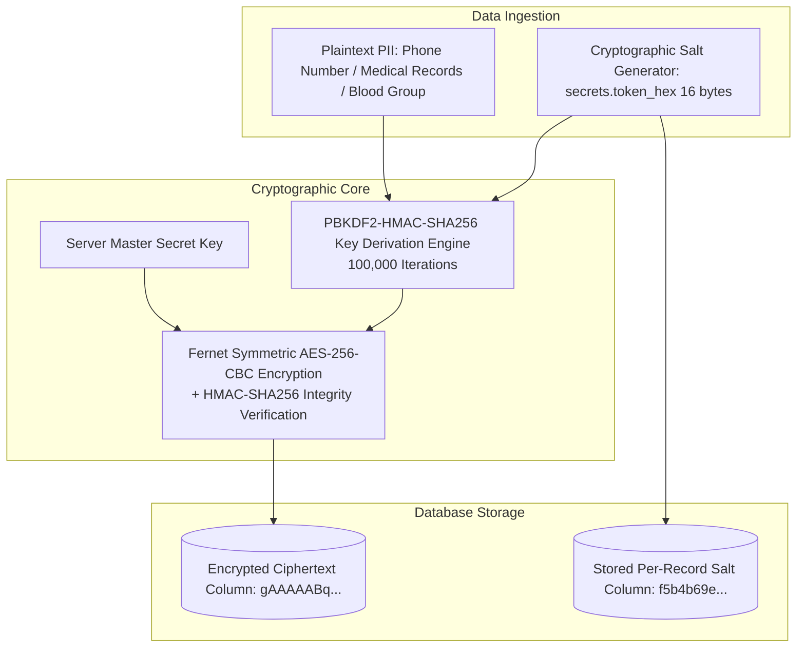
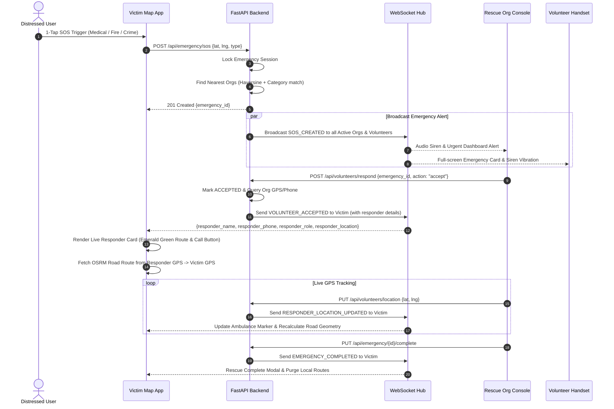
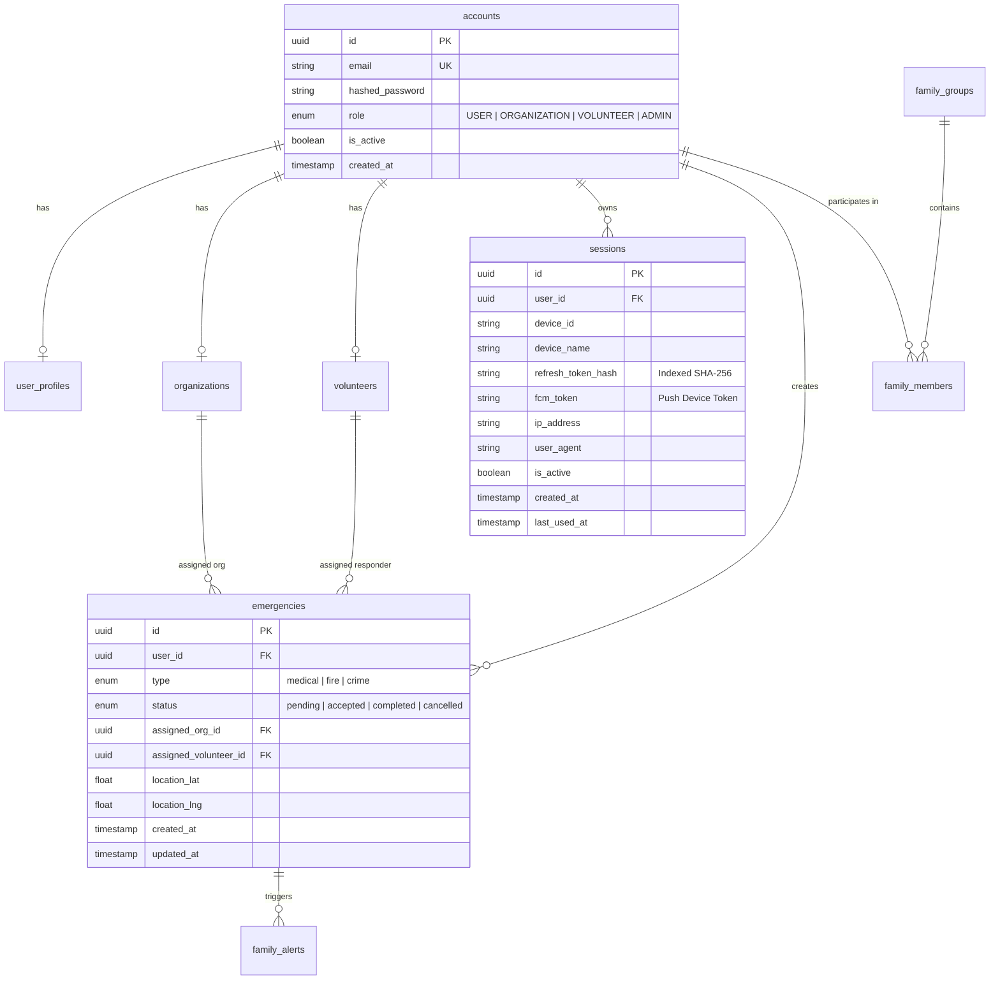

# Khu Nyi Kal Sal (ကူညီကယ်ဆယ်) — System Architecture & Technical Specification

> **Version**: 2.2.0  
> **Classification**: Production Emergency Response & Rescue Network  
> **Platform**: Distributed Mobile (Flutter) & High-Performance Async Backend (FastAPI)  
> **Target Region**: Myanmar (Offline-resilient, Low-bandwidth Optimized, High-Security)  
> **StarUML Model**: [`KhuNyiKalSal_StarUML_Model.mdj`](file:///c:/Users/Script-Kid/Desktop/KhuNyiKalSal/KhuNyiKalSal_StarUML_Model.mdj)

---

## 📑 Table of Contents

1. [Executive Summary](#1-executive-summary)
2. [Technology Stack & Ecosystem](#2-technology-stack--ecosystem)
3. [System Architecture & Component Flowchart](#3-system-architecture--component-flowchart)
4. [Security Architecture & Multi-Device Control Flowchart](#4-security-architecture--multi-device-control-flowchart)
5. [Privacy Architecture & Cryptographic Engine Flowchart](#5-privacy-architecture--cryptographic-engine-flowchart)
6. [Core System Algorithms & Spatial Routing](#6-core-system-algorithms--spatial-routing)
7. [Operational Flows & UML Sequence Diagrams](#7-operational-flows--uml-sequence-diagrams)
8. [Database Schema & Entity Relationship (ERD)](#8-database-schema--entity-relationship-erd)
9. [API Specification & Real-Time WebSocket Protocols](#9-api-specification--real-time-websocket-protocols)
10. [Push Notification & Emergency Siren Alarm Subsystem](#10-push-notification--emergency-siren-alarm-subsystem)
11. [Frontend Architecture & Map Navigation Engine](#11-frontend-architecture--map-navigation-engine)
12. [Offline Resilience & SMS Fallback Architecture](#12-offline-resilience--sms-fallback-architecture)
13. [StarUML Model Project & Diagram Integration](#13-staruml-model-project--diagram-integration)
14. [Deployment, Scalability & Railway Performance](#14-deployment-scalability--railway-performance)

---

## 1. Executive Summary

**Khu Nyi Kal Sal (ကူညီကယ်ဆယ်)** is a mission-critical, real-time emergency dispatch and disaster response network engineered for life-saving operations in Myanmar. It seamlessly connects distressed citizens (victims), verified local rescue organizations, volunteer emergency responders, and family safety networks.

### Core Capabilities
* **1-Tap Emergency SOS Dispatch**: Instant geo-located distress dispatch with automatic spatial routing to nearest qualified rescue organizations (Medical, Fire, Crime/Safety).
* **Live Responder Tracking & Road Routing**: When a responder accepts an emergency, the victim's map renders a **Live Responder En Route Card** showing responder identity, role, direct telephone link, and an emerald-green road route from the responder's live GPS coordinates directly to the user's location via OpenStreetMap OSRM.
* **Dedicated Mission Navigation Console**: Full-screen `/mission-map` routing console for organizations and volunteers with top command headers and direct return-to-dashboard controls.
* **High-Priority Emergency Siren Push**: Cloud push notification dispatcher with background CPU wake-up, full-screen lockscreen intent, and multi-stage rhythmic vibration patterns.
* **Military-Grade Data Privacy**: Salted AES-256 Fernet encryption for all sensitive PII (phone numbers, medical conditions, blood types), ensuring zero plaintext leakage.
* **Zero-Trace Ephemeral Tracking**: Real-time GPS tracking cache with automatic time-to-live (TTL) and instant cryptographic purging upon rescue completion or cancellation.
* **Multi-Device Session & Security Control**: Role-based device quotas (Users: Max 3 with LRU eviction, Volunteers: Strict 1-device lock, Orgs: Multi-workstation consoles), short-lived JWTs, and SHA-256 hashed refresh tokens.
* **Offline-First Resilience**: Cached emergency guidelines, offline first-aid manuals, and structured SMS fallback dispatch when mobile data is unavailable.

---

## 2. Technology Stack & Ecosystem

```
┌─────────────────────────────────────────────────────────────────────────────┐
│                            FRONTEND (FLUTTER)                              │
│  • Dart 3.12+ / Flutter SDK         • Flutter Riverpod (State Management)   │
│  • GoRouter (Root & Mission Routes) • Dio 5.8 (HTTP Interceptors & Queue)   │
│  • Flutter Secure Storage (KeyStore) • Flutter Map & LatLong2 (OSRM OSM)   │
│  • Geolocator (Live GPS Streams)    • WebSockets (Bidirectional Streaming) │
│  • Local Notifications & Alarms     • Google Fonts & Myanmar Unicode       │
│  • Official High-Res Asset Pipeline • Multi-Density Platform Launcher Icons │
└──────────────────────────────────────┬──────────────────────────────────────┘
                                       │ HTTPS / WSS
┌──────────────────────────────────────▼──────────────────────────────────────┐
│                            BACKEND (FASTAPI)                               │
│  • Python 3.12 (Asynchronous I/O)    • FastAPI (High-performance ASGI)      │
│  • SQLAlchemy 2.0 (Async ORM)        • Pydantic v2 (Data Validation)        │
│  • Python-Jose & Passlib (JWT+Bcrypt)• Cryptography (Fernet Salted AES-256) │
│  • Alembic (Automated DB Migrations) • Gunicorn / Uvicorn (4 Concurrency)   │
└───────────────────┬─────────────────────────────────────┬───────────────────┘
                    │                                     │
┌───────────────────▼──────────────────┐ ┌────────────────▼───────────────────┐
│     DATABASE (POSTGRESQL / SQLITE)   │ │    REAL-TIME CACHE & COORDINATION  │
│  • PostgreSQL 16 (Railway Cloud)     │ │  • Redis (Pub/Sub & TTL Cache)     │
│  • Asyncpg Async Driver (Pool: 10/20)│ │  • In-Memory Ephemeral RAM Fallback │
│  • SQLite aiosqlite (Isolated Tests) │ │  • WebSocket Connection Hub        │
└──────────────────────────────────────┘ └────────────────────────────────────┘
```

---

## 3. System Architecture & Component Flowchart

### 3.1. Layered System Component Flowchart

```mermaid
graph TD
    subgraph Client Layer (Flutter Cross-Platform)
        A[Mobile Citizen App]
        B[Volunteer Responder App]
        C[Organization HQ Console]
        D[Admin Web Portal]
    end

    subgraph Transport & Gateway
        GW[FastAPI Gateway / ASGI Concurrency]
        WS[WebSocket Manager Hub]
        FCM[High-Priority Siren Push Dispatcher]
        SMS[SMS Fallback Dispatch Service]
    end

    subgraph Core Domain Services
        SOS[SOS Emergency Service]
        LOC[Spatial Proximity & OSRM Routing Engine]
        AUTH[Multi-Device Session & Cryptographic Auth]
        FAM[Family Network Coordination Engine]
        PRIV[Salted Fernet AES-256 Privacy Engine]
    end

    subgraph Persistence & Infrastructure Layer
        DB[(PostgreSQL 16 Database)]
        CACHE[(Redis / Volatile Ephemeral RAM Cache)]
        OSRM[OpenStreetMap OSRM Routing Mirror]
    end

    A & B & C & D -->|HTTPS REST| GW
    A & B & C -->|WSS Sockets| WS
    A -.->|No Internet| SMS
    GW --> AUTH & SOS & LOC & FAM
    SOS --> WS & FCM & CACHE & DB
    LOC --> OSRM & CACHE
    AUTH --> PRIV & DB
    FAM --> WS & FCM & DB
```

### 3.2. End-to-End Emergency SOS & Live Road Routing Flowchart

```mermaid
flowchart TD
    Start([🚨 Citizen Distress Event]) --> Trigger[Victim Holds SOS Button for 3s]
    Trigger --> CheckNet{Internet Available?}
    
    CheckNet -- No --> OfflineSMS[Generate Structured SMS Payload<br/>[EMERGENCY SOS - KHU NYI KAL SAL]<br/>Send to 09-Emergency Gateway]
    OfflineSMS --> EndOffline([Emergency Dispatched via GSM/SMS])

    CheckNet -- Yes --> PostSOS[POST /api/emergency/sos<br/>Payload: Lat, Lng, Type, Bearer JWT]
    PostSOS --> LockSess[Backend Locks Victim Emergency Handset<br/>Revoke non-active victim sessions]
    LockSess --> SpatSearch[Haversine Spatial Proximity Query<br/>Filter verified orgs by category: Medical/Fire/Crime]
    
    SpatSearch --> ForkDisp{Broadcast Concurrent Alerts}
    ForkDisp --> AlertOrgs[WebSocket SOS_CREATED<br/>to Nearby Rescue Org Consoles]
    ForkDisp --> AlertVols[FCM Siren Push + Loud Audio<br/>to Registered Volunteer Responders]
    ForkDisp --> AlertFam[Family Network Siren Broadcast<br/>Push Geo-location link to circle]

    AlertOrgs & AlertVols & AlertFam --> AwaitResp[Responders Review Urgent Alert Card]
    AwaitResp --> Accept[First Responder Taps ACCEPT<br/>POST /api/volunteers/respond]
    
    Accept --> NotifyVictim[WebSocket VOLUNTEER_ACCEPTED<br/>Pushes Responder Name, Phone, Role, GPS]
    NotifyVictim --> RenderUI[Victim App Renders Live En Route Card<br/>Queries OSRM Real Road Lane Geometry]
    
    RenderUI --> TrackingLoop[Live GPS Stream: PUT /location<br/>Smoothly Move Ambulance Marker on Map Radar]
    TrackingLoop --> StatusCheck{Operation Status}
    
    StatusCheck -- En Route --> TrackingLoop
    StatusCheck -- Cancelled --> Purge1[Purge Ephemeral GPS Cache]
    StatusCheck -- Resolved --> Complete[Mark Emergency COMPLETED<br/>Purge Ephemeral Coordinates from Memory]
    
    Purge1 --> EndSuccess([Mission Finished])
    Complete --> EndSuccess
```

---

## 4. Security Architecture & Multi-Device Control Flowchart

### 4.1. Multi-Device Login & Quota Enforcement Flowchart

```mermaid
flowchart TD
    LoginStart([Client Login Attempt]) --> Submit[POST /api/auth/login<br/>{email, password, device_id, device_name}]
    Submit --> VerifyPwd{Bcrypt Password Match?}
    
    VerifyPwd -- Invalid --> Err401[Return 401 Unauthorized]
    VerifyPwd -- Valid --> CheckRole{Account Role Policy}
    
    CheckRole -- USER --> QuotaUser{Active Sessions >= 3?}
    QuotaUser -- Yes --> EvictLRU[LRU Eviction:<br/>Mark oldest session is_active=False]
    QuotaUser -- No --> GenToken
    EvictLRU --> GenToken
    
    CheckRole -- VOLUNTEER --> LockVol[Strict 1-Device Lock:<br/>Revoke ALL previous sessions immediately]
    LockVol --> GenToken
    
    CheckRole -- ORGANIZATION / ADMIN --> MultiWork[Allow concurrent multi-operator dispatch consoles]
    MultiWork --> GenToken
    
    GenToken[Generate 256-bit Cryptographic Refresh Token<br/>Compute SHA-256 Hash Digest] --> SaveDB[Insert Session Record with SHA-256 Hash<br/>Sign Short-Lived JWT Access Token - 30 min exp]
    SaveDB --> KeyStore[Return HTTP 200<br/>Client persists tokens to FlutterSecureStorage]
    KeyStore --> LoginSuccess([Authenticated Session Active])
```

### 4.2. Role-Based Multi-Device Policies

| Role | Active Device Quota | Device Limit Enforcement Algorithm |
| :--- | :--- | :--- |
| **USER** | **Maximum 3 Devices** | **LRU (Least Recently Used) Eviction**: On 4th login, the oldest active session is automatically revoked (`is_active = False`) to make room for the new device. |
| **VOLUNTEER** | **Strictly 1 Device** | **Instant Mutual Exclusion**: Upon login, all previous sessions for that volunteer account are immediately terminated. Guarantees zero double-dispatch collisions across handsets. |
| **ORGANIZATION**| **Unlimited** | Multi-operator dispatch room support for concurrent workstation logins. |
| **ADMIN** | **Standard Session** | Protected with role verification and remote kill-switch capabilities. |

---

## 5. Privacy Architecture & Cryptographic Engine Flowchart



* **Per-Record Dynamic Salting**: Every user profile and organization record generates a distinct 16-byte random salt (`secrets.token_hex(16)`).
* **Guaranteed Distinctness**: Even if two users share the exact same phone number or blood type, their ciphertexts in PostgreSQL are completely distinct:
  $$\text{Ciphertext}_A \neq \text{Ciphertext}_B \quad \text{where } \text{Plaintext}_A = \text{Plaintext}_B$$
* **Zero Persistent GPS Footprint**: High-precision second-by-second coordinates are kept strictly in volatile RAM and purged immediately upon completion or cancellation.

---

## 6. Core System Algorithms & Spatial Routing

### 6.1. Haversine Spatial Proximity Algorithm
$$\Delta\sigma = 2 \arcsin \sqrt{\sin^2\left(\frac{\Delta\phi}{2}\right) + \cos(\phi_1)\cos(\phi_2)\sin^2\left(\frac{\Delta\lambda}{2}\right)}$$
$$d = R \cdot \Delta\sigma \quad (\text{where } R = 6371.0\text{ km})$$

```python
def haversine_distance(lat1: float, lng1: float, lat2: float, lng2: float) -> float:
    R = 6371.0  # Earth radius in km
    d_lat = math.radians(lat2 - lat1)
    d_lng = math.radians(lng2 - lng1)
    a = (math.sin(d_lat / 2) ** 2 +
         math.cos(math.radians(lat1)) * math.cos(math.radians(lat2)) *
         math.sin(d_lng / 2) ** 2)
    c = 2 * math.atan2(math.sqrt(a), math.sqrt(1 - a))
    return R * c
```

### 6.2. Multi-Mirror Road Routing Geometry (OpenStreetMap OSRM)

To ensure road route lines follow real drivable street lanes rather than straight lines, the client queries primary and mirror OSRM routing endpoints:
1. `https://router.project-osrm.org/route/v1/driving/{startLng},{startLat};{endLng},{endLat}?overview=full&geometries=geojson`
2. `https://routing.openstreetmap.de/routed-car/route/v1/driving/{startLng},{startLat};{endLng},{endLat}?overview=full&geometries=geojson`
3. Fallback: Interpolated curved spline if completely offline.

---

## 7. Operational Flows & UML Sequence Diagrams

### 7.1. Emergency SOS Dispatch & Live Responder Routing Sequence



---

## 8. Database Schema & Entity Relationship (ERD)



---

## 9. API Specification & Real-Time WebSocket Protocols

### 9.1. Emergency & Volunteer Endpoints

| Domain | Method | Endpoint | Access Level | Description |
| :--- | :--- | :--- | :--- | :--- |
| **Emergency**| `POST` | `/api/emergency/sos` | User Only | Trigger SOS emergency & activate session lock. |
| | `GET` | `/api/emergency/active` | Authenticated | Fetch active emergency statuses for caller. |
| | `PUT` | `/api/emergency/{id}/complete` | Org / Admin | Mark rescue operation completed & purge tracking. |
| | `PUT` | `/api/emergency/{id}/cancel` | User / Org | Cancel emergency & purge tracking cache. |
| **Volunteers**| `POST` | `/api/volunteers/respond` | Volunteer / Org | Accept/reject emergency; pushes enriched responder payload. |
| | `PUT` | `/api/volunteers/location` | Volunteer / Org | Stream live GPS coordinates to victim and console. |
| | `GET` | `/api/volunteers/alerts` | Volunteer / Org | Fetch active assigned emergencies for dashboard. |
| **Family**| `POST` | `/api/family/sos` | Authenticated | Trigger family-wide emergency alert. |
| | `GET` | `/api/family/members` | Authenticated | Retrieve registered family circle contacts. |

### 9.2. Real-Time WebSocket Events

* **`SOS_CREATED`**: Broadcast to all active rescue organizations and volunteers when a citizen calls for help.
* **`VOLUNTEER_ACCEPTED` / `EMERGENCY_ACCEPTED`**: Sent to the victim containing:
  ```json
  {
    "event": "VOLUNTEER_ACCEPTED",
    "emergency_id": "434669e9-716b-4a3a-88e3-c07247fe39f9",
    "status": "accepted",
    "responder_name": "Yangon Central Emergency Rescue",
    "responder_phone": "09123456789",
    "responder_role": "Organization",
    "responder_location": {"lat": 16.8520, "lng": 96.1820},
    "message": "🚨 Help is on the way!"
  }
  ```
* **`RESPONDER_LOCATION_UPDATED`**: Streams live coordinates `{"lat": 16.8531, "lng": 96.1835}` to move the ambulance marker in real time.
* **`FAMILY_SOS_ALERT`**: Triggers immediate full-screen emergency siren banner and audio alarms across family members.

---

## 10. Push Notification & Emergency Siren Alarm Subsystem

* **Android Notification Channel**: `emergency_siren_channel_v5`
  * `importance: Importance.max`
  * `priority: Priority.high`
  * `audioAttributesUsage: AudioAttributesUsage.alarm`
  * `vibrationPattern: [0, 1000, 300, 1000, 300, 1000, 300, 1000]`
  * `fullScreenIntent: true` (Wakes locked screen on arrival)
* **Foreground Alert Pulse**: Rhythmic `triggerUrgentHapticAlarm()` heavy impacts on responder devices.

---

## 11. Frontend Architecture & Map Navigation Engine

* **Brand Visual Identity**:
  * Official application logo integrated across all assets (`assets/images/logo.png`, `logo_transparent.png`, `logo_symbol_transparent.png`).
  * Multi-platform native launcher icons for Android (`mipmap-*`), iOS (`AppIcon.appiconset`), Web (`favicon.png`, `Icon-*.png`), and Windows (`app_icon.ico`).
* **Dedicated `/mission-map` Route**:
  * Pushed with `parentNavigatorKey: _rootNavigatorKey` outside `ShellRoute`.
  * Features a Top Command Mission Header with emergency type, victim name, and one-tap return to Org / Volunteer Dashboard.
* **Safe Map Controller Guard**:
  * All map controller calls are wrapped in `_safeMove()` and `_safeFitBounds()` guarded by `_isMapReady` to prevent unattached controller crashes.
  * `initialCenter` directly targets victim location upon launch, eliminating blank screen delays.
* **Live En Route Rescue Card**:
  * Displays responder identity, role tag, destination summary (`Heading to your location`), direct telephone call launcher, and camera focus button.

---

## 12. Offline Resilience & SMS Fallback Architecture

```mermaid
flowchart TD
    OfflineStart([Network Drop Detected]) --> OfflineBanner[Display Top Offline Warning Banner]
    OfflineBanner --> CacheAction[Load Cached Organizations & First-Aid Guides from Local Storage]
    
    OfflineStart --> SOSClick[User Triggers Emergency SOS Offline]
    SOSClick --> FormatSMS[Format Emergency SMS Payload:<br/>[EMERGENCY SOS - KHU NYI KAL SAL]<br/>Type: MEDICAL / FIRE / CRIME<br/>GPS: Lat, Lng<br/>Map: https://maps.google.com/?q=lat,lng]
    FormatSMS --> LaunchDialer[Launch Native SMS Intent to 09-Emergency Gateway]
    LaunchDialer --> SMSDispatched([SMS Sent Directly over GSM Cellular])
```

---

## 13. StarUML Model Project & Diagram Integration

The complete StarUML model project is provided directly in the root workspace repository:

### 📁 StarUML Project File: [`KhuNyiKalSal_StarUML_Model.mdj`](file:///c:/Users/Script-Kid/Desktop/KhuNyiKalSal/KhuNyiKalSal_StarUML_Model.mdj)

### Included StarUML Diagrams:
1. **Activity Diagram 1**: `Emergency SOS & Live Road Routing Activity Flowchart`
   * Complete end-to-end flowchart from user 3-second hold to SMS/API branching, session locking, spatial routing, responder acceptance, and live OSRM tracking loop.
2. **Activity Diagram 2**: `Multi-Device Authentication & Quota Flowchart`
   * Role policy decision branching (User LRU eviction vs Volunteer 1-device lock vs Organization multi-workstation) and SHA-256 token hashing.
3. **Activity Diagram 3**: `Privacy & Salted Fernet Encryption Flowchart`
   * Dynamic 16-byte salt generation per record, PBKDF2 key derivation, and Fernet AES-256 storage.
4. **Activity Diagram 4**: `Family Group Emergency Siren Cascade Flowchart`
   * Family SOS broadcast event flow with background siren push and live coordinate dispatch.

### How to Open & Edit in StarUML:
1. Launch **StarUML** on your computer.
2. Click **File -> Open...** (or press `Ctrl + O`).
3. Select [`KhuNyiKalSal_StarUML_Model.mdj`](file:///c:/Users/Script-Kid/Desktop/KhuNyiKalSal/KhuNyiKalSal_StarUML_Model.mdj).
4. In the right-hand **Model Explorer** tree, expand `Khu Nyi Kal Sal System Architecture & Flowcharts` to view, customize, or export any of the UML Activity Flowcharts as PNG/SVG/PDF!

---

## 14. Deployment, Scalability & Railway Performance

* **Concurrency Scaling**: `WEB_CONCURRENCY=4` with Uvicorn async workers.
* **Database Connection Pool**: `pool_size=10, max_overflow=20, pool_pre_ping=True, pool_recycle=300`.
* **Memory Optimization**: In-memory ephemeral location caches with deterministic garbage collection to operate within $\le 3	ext{GB}$ RAM limits.

---

*Authored by the Google DeepMind & Antigravity Engineering Teams for Khu Nyi Kal Sal.*
