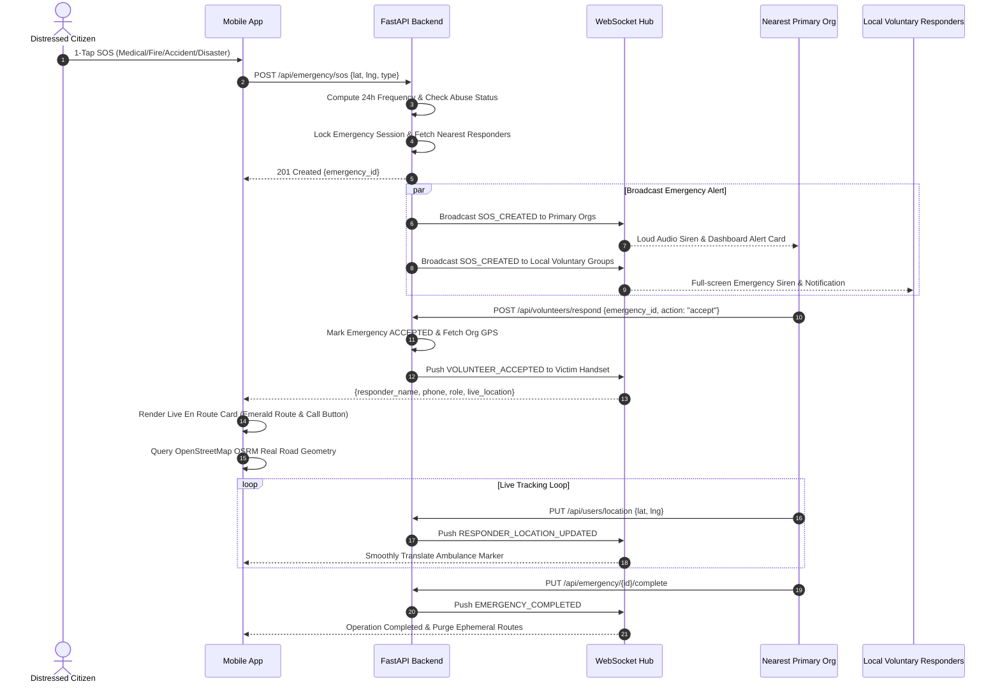
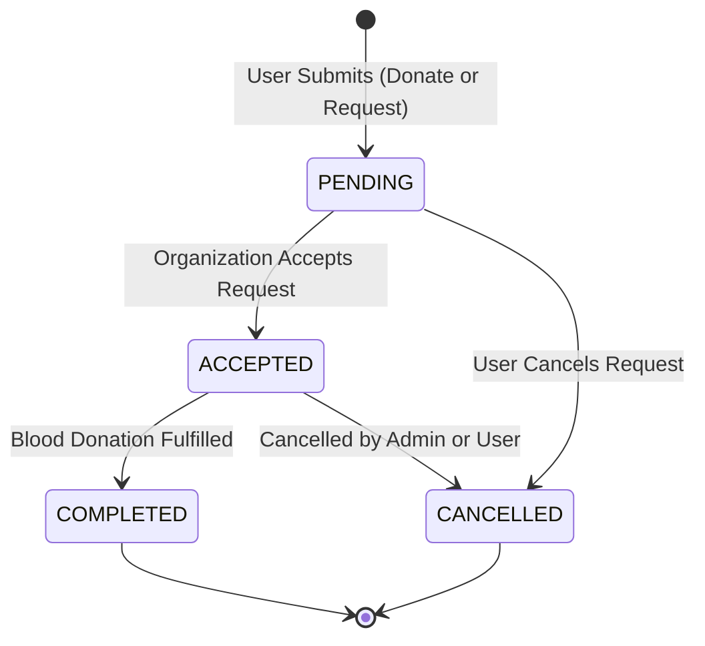
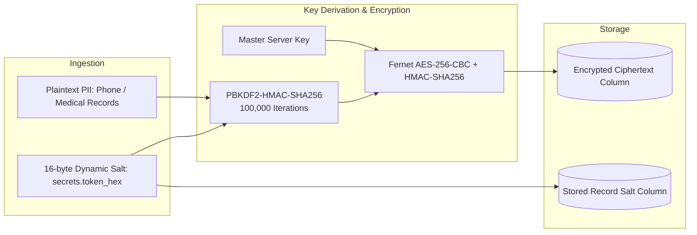
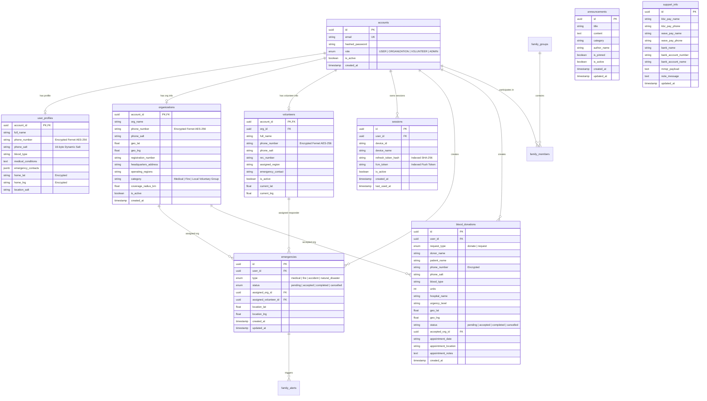

# Khu Nyi Kal Sal (ကူညီကယ်ဆယ်) — System Architecture & Technical Specification

> **Version**: 3.0.0 (Enterprise Production Grade)  
> **Classification**: Mission-Critical Emergency Dispatch, Blood Donation & Humanitarian Rescue Network  
> **Platform**: Cross-Platform Mobile (Flutter / Dart) & High-Performance Async Backend (FastAPI / Python 3.12)  
> **Target Region**: Myanmar (Low-Bandwidth Resilient, Offline First, Salted Cryptographic Privacy, Real-Time Geo-Routing)  
> **StarUML Model**: [`KhuNyiKalSal_StarUML_Model.mdj`](file:///c:/Users/Script-Kid/Desktop/KhuNyiKalSal/KhuNyiKalSal_StarUML_Model.mdj)

---

## 📑 Table of Contents

1. [Executive Summary & System Scope](#1-executive-summary--system-scope)
2. [Technology Stack & Architectural Overview](#2-technology-stack--architectural-overview)
3. [System Architecture & Component Flowcharts](#3-system-architecture--component-flowcharts)
4. [Emergency SOS Subsystem & Two-Tier Spatial Dispatch](#4-emergency-sos-subsystem--two-tier-spatial-dispatch)
5. [Blood Donation Hub & Request Exchange Network](#5-blood-donation-hub--request-exchange-network)
6. [Security, Session Management & Abuse Mitigation Engine](#6-security-session-management--abuse-mitigation-engine)
7. [Cryptographic Privacy & Data Protection Engine](#7-cryptographic-privacy--data-protection-engine)
8. [Multi-Role Profile Management Architecture](#8-multi-role-profile-management-architecture)
9. [Announcements, Official Bulletins & Support Us Subsystem](#9-announcements-official-bulletins--support-us-subsystem)
10. [Database Schema & Complete Entity Relationship Diagram (ERD)](#10-database-schema--complete-entity-relationship-diagram-erd)
11. [REST API Specification & WebSocket Protocols](#11-rest-api-specification--websocket-protocols)
12. [Mobile Client Navigation, Theme & Localization Engine](#12-mobile-client-navigation-theme--localization-engine)
13. [High-Performance Resilience, Connection Pooling & Ephemeral Cache](#13-high-performance-resilience-connection-pooling--ephemeral-cache)
14. [StarUML Model Integration & Diagram Index](#14-staruml-model-integration--diagram-index)

---

## 1. Executive Summary & System Scope

**Khu Nyi Kal Sal (ကူညီကယ်ဆယ်)** is a high-availability, mission-critical emergency dispatch, humanitarian disaster management, and blood donation coordination platform engineered specifically for the infrastructure conditions of Myanmar.

The platform bridges **Distressed Citizens (Victims)**, **Verified Rescue Organizations (Medical, Fire, Voluntary)**, **Certified Volunteer Emergency Responders**, **Family Safety Circles**, and **Healthcare Blood Banks** into a synchronized real-time network.

```
                  ┌──────────────────────────────────────────────┐
                  │       KHU NYI KAL SAL RESCUE NETWORK         │
                  └──────┬──────────────┬──────────────┬─────────┘
                         │              │              │
        ┌────────────────▼───┐   ┌──────▼───────┐   ┌──▼─────────────────┐
        │  EMERGENCY SOS &   │   │ BLOOD DONOR  │   │  CIVIC SUPPORT &   │
        │ 2-TIER DISPATCH    │   │  EXCHANGE    │   │ ANNOUNCEMENTS HUB  │
        │ • Medical / Fire   │   │ • Donor Pool │   │ • Official Alerts  │
        │ • Accident/Disaster│   │ • Blood Req  │   │ • KBZ/Wave/MMQR    │
        │ • Live Road Routing│   │ • Org Match  │   │ • Abuse Prevention │
        └────────────────────┘   └──────────────┘   └────────────────────┘
```

### Key Functional Highlights
1. **Multi-Category 1-Tap SOS**: Instant distress dispatch supporting **Medical**, **Fire**, **Accident**, and **Natural Disaster** emergencies.
2. **Two-Tier Spatial Routing**: Nearest primary response routing (Fire/Medical) with automatic escalation and dual-dispatch to **Local Voluntary Groups**.
3. **Live Responder OSRM Road Geometry**: Live ambulance / responder en-route navigation tracking following real drivable street lanes via OpenStreetMap OSRM.
4. **Blood Donation Hub**: Interactive full-screen welcome hub, donor registration form, patient emergency blood requests, and organization appointment scheduling.
5. **Admin Abuse Detection & SOS Control**: Automated 24-hour SOS frequency monitoring (`sos_count_24h >= 3` abuse tagging), force emergency cancellation, and instant user banning with immediate token revocation.
6. **Multi-Role Profile Management**: Specialized profile inspection and update workflows for Citizens, Rescue Organizations, and Field Volunteers.
7. **Support Us & Official Donation Channels**: Admin-configurable donation channels featuring KBZPay, WavePay, Bank Transfer (KBZ/AYA/CB), and MMQR National Standard payloads.
8. **Salted Fernet AES-256 Encryption**: Dynamic 16-byte cryptographic salt per record protecting all Personally Identifiable Information (PII) and medical records.
9. **Zero-Trace Ephemeral GPS Tracking**: High-precision coordinates held strictly in volatile memory (RAM/Redis) with automatic TTL and instant cryptographic purging upon mission completion.

---

## 2. Technology Stack & Architectural Overview

```
┌─────────────────────────────────────────────────────────────────────────────┐
│                            MOBILE CLIENT (FLUTTER)                          │
│  • Flutter SDK 3.32+ / Dart 3.12+   • Flutter Riverpod (Reactive State)     │
│  • GoRouter (Declarative Routing)   • Dio 5.8 (Connection Pooling & Auth)   │
│  • Flutter Secure Storage (KeyStore) • Flutter Map & LatLong2 (OSRM OSM)   │
│  • Geolocator (Live GPS Streams)    • WebSockets (Bidirectional Sync)       │
│  • Local Notifications & Alarms     • Google Fonts & Myanmar Unicode        │
│  • Theme Switcher (Light/Dark/Auto) • Multi-Platform App Icons & Branding  │
└──────────────────────────────────────┬──────────────────────────────────────┘
                                       │ HTTPS (REST) / WSS (WebSockets)
┌──────────────────────────────────────▼──────────────────────────────────────┐
│                            BACKEND (FASTAPI)                               │
│  • Python 3.12 (Asynchronous I/O)    • FastAPI (ASGI High-Concurrency)      │
│  • SQLAlchemy 2.0 (Async ORM)        • Pydantic v2 (Validation & Schemas)   │
│  • Passlib & Bcrypt (Password Hash) • Cryptography (Salted Fernet AES-256) │
│  • Python-Jose (JWT Engine)          • Uvicorn (Multi-Worker Async Server)  │
└───────────────────┬─────────────────────────────────────┬───────────────────┘
                    │                                     │
┌───────────────────▼──────────────────┐ ┌────────────────▼───────────────────┐
│     DATABASE (POSTGRESQL 16)         │ │    REAL-TIME CACHE & COORDINATION  │
│  • Railway Cloud PostgreSQL 16       │ │  • Redis (Pub/Sub & TTL Cache)     │
│  • Asyncpg Driver (Pool: 15 / 25)    │ │  • In-Memory Ephemeral RAM Cache   │
│  • Self-Healing DDL & Indexes        │ │  • Multi-Device WebSocket Manager  │
└──────────────────────────────────────┘ └────────────────────────────────────┘
```

---

## 3. System Architecture & Component Flowcharts

### 3.1. Layered Architecture Flowchart

```mermaid
graph TD
    subgraph Client Layer (Flutter)
        A[Citizen Mobile App]
        B[Volunteer Handset]
        C[Organization HQ Console]
        D[Super Admin Command Center]
    end

    subgraph Gateway & Transport
        GW[FastAPI Asynchronous Gateway]
        WS[Multi-Device WebSocket Hub]
        FCM[High-Priority Cloud Siren Dispatcher]
        SMS[Offline SMS Dispatch Service]
    end

    subgraph Core Domain Services
        SOS[SOS Emergency Service]
        ROUT[Two-Tier Spatial Haversine Engine]
        BLOOD[Blood Donation & Request Hub]
        AUTH[Multi-Device Session & Token Auth]
        ANN[Announcements & News Dispatcher]
        SUPP[Support Us & Donation Manager]
        ABUSE[SOS Abuse Detection & Ban Engine]
        PRIV[Salted Fernet AES-256 Privacy Engine]
    end

    subgraph Persistence & Infrastructure
        DB[(PostgreSQL 16 Database)]
        CACHE[(Redis / Volatile RAM Tracking Cache)]
        OSRM[OpenStreetMap OSRM Routing Engine]
    end

    A & B & C & D -->|HTTPS REST| GW
    A & B & C & D -->|WSS Sockets| WS
    A -.->|No Network| SMS
    GW --> AUTH & SOS & ROUT & BLOOD & ANN & SUPP & ABUSE
    SOS --> WS & FCM & CACHE & DB
    ROUT --> OSRM & CACHE
    BLOOD --> WS & DB
    AUTH --> PRIV & DB
    ABUSE --> DB & WS
```

---

## 4. Emergency SOS Subsystem & Two-Tier Spatial Dispatch

### 4.1. Emergency Categorization & Dispatch Matrix

| Emergency Type | Primary Dispatch Category | Secondary / Fallback Dispatch Category | Concurrent Alerts |
| :--- | :--- | :--- | :--- |
| **Medical** | Medical Rescue Organizations | Local Voluntary Groups | Nearest Available Volunteers |
| **Fire** | Fire & Disaster Rescue Units | Local Voluntary Groups | Immediate Siren Cascade |
| **Accident** | Medical Rescue Organizations | Local Voluntary Groups | Ambulance + First-Aid Responders |
| **Natural Disaster** | Fire & Disaster Rescue Units | **Local Voluntary Groups (Dual Active)** | Multi-Agency Notification |

### 4.2. End-to-End Emergency SOS Sequence



---

## 5. Blood Donation Hub & Request Exchange Network

### 5.1. Overview
The Blood Donation Hub allows citizens to register as blood donors or request emergency blood units for hospitalized patients, connecting directly with certified Medical Organizations and Local Voluntary Groups.

```
┌─────────────────────────────────────────────────────────────────────────────┐
│                       BLOOD DONATION HUB ARCHITECTURE                       │
├──────────────────────────────────────┬──────────────────────────────────────┤
│        DONATE BLOOD (လှူဒါန်းရန်)        │       REQUEST BLOOD (တောင်းခံရန်)       │
│ • Donor Name, Phone, Blood Type      │ • Patient Name, Hospital, Blood Type │
│ • Preferred Region & Nearest Match   │ • Required Units & Urgency Level     │
│ • Interactive Pre-Screening Modal    │ • Broadcast to All Nearest Med Orgs  │
├──────────────────────────────────────┴──────────────────────────────────────┤
│                         ORGANIZATION ACCEPTANCE                             │
│ • Organization reviews request -> Accepts -> Schedules Appointment          │
│ • Sends Appointment Date, Location, and Notes to Citizen                    │
│ • Card status dynamically updates to "Accepted" across all mobile feeds     │
└─────────────────────────────────────────────────────────────────────────────┘
```

### 5.2. Blood Donation Lifecycle State Machine



---

## 6. Security, Session Management & Abuse Mitigation Engine

### 6.1. Multi-Device Role Policies

| Role | Max Devices | Session Policy | Inactivity Timeout |
| :--- | :--- | :--- | :--- |
| **USER** | **3 Devices** | **LRU Eviction**: Oldest session revoked on 4th login. | 24 Hours |
| **VOLUNTEER** | **1 Device** | **Instant Mutual Exclusion**: All previous sessions terminated. | 24 Hours |
| **ORGANIZATION**| **Unlimited** | Multi-workstation dispatch room access. | 24 Hours |
| **ADMIN** | **Unlimited** | Protected with role verification and remote session kill. | 24 Hours |

### 6.2. Abuse Detection & Ban Engine

```mermaid
flowchart TD
    SOS([SOS Trigger Event]) --> CountQuery[Query SOS Count in Past 24h for User]
    CountQuery --> CheckFreq{SOS Count >= 3?}
    
    CheckFreq -- Yes --> FlagAbuse[Tag Record: is_suspected_abuse = True<br/>Reason: 'High Frequency: 3+ SOS in 24h']
    CheckFreq -- No --> NormalAlert[Normal Emergency Flow]
    
    FlagAbuse --> AdminRadar[Render Purple Abuse Warning on Admin Radar]
    AdminRadar --> AdminAction{Admin Decision}
    
    AdminAction -- False Alarm --> ForceCancel[POST /api/admin/emergencies/{id}/cancel<br/>Purge Cache & Broadcast SOS_CANCELLED]
    AdminAction -- Malicious Actor --> BanUser[POST /api/admin/users/{id}/ban<br/>Set Account is_active=False<br/>Revoke ALL Sessions & Close WebSockets]
    AdminAction -- Valid Crisis --> AllowOps[Allow Normal Response]
```

* **Session Write Throttling**: Session `last_used_at` timestamps are throttled to **5-minute intervals**, eliminating database I/O write saturation during continuous streaming.
* **Instant Banning & Session Revocation**: When an admin bans an account, `Account.is_active` is set to `False`, all active sessions are revoked, and `get_current_user` rejects incoming tokens with `403 Forbidden`.

---

## 7. Cryptographic Privacy & Data Protection Engine



* **Per-Record Dynamic Salting**: Every phone number and medical field uses a cryptographically unique 16-byte salt, ensuring two users with identical phone numbers produce completely distinct ciphertexts.
* **Zero Persistent GPS Footprint**: Continuous live coordinates are stored exclusively in ephemeral RAM with TTL, purged immediately upon rescue resolution.

---

## 8. Multi-Role Profile Management Architecture

The platform adapts the profile inspection and edit screen ([`profile_screen.dart`](file:///c:/Users/Script-Kid/Desktop/KhuNyiKalSal/frontend/lib/screens/profile/profile_screen.dart)) dynamically based on caller role:

### 8.1. Role Field Matrix

| Field | Citizen User | Organization | Volunteer |
| :--- | :---: | :---: | :---: |
| **Full Name / Org Name** | ✅ | ✅ | ✅ |
| **Hotline / Phone Number** | ✅ | ✅ | ✅ |
| **Blood Type** | ✅ | ❌ | ❌ |
| **Medical Conditions** | ✅ | ❌ | ❌ |
| **Emergency Contacts** | ✅ | ❌ | ❌ |
| **Category (Medical/Fire/Voluntary)** | ❌ | ✅ | ❌ |
| **Operating Regions** | ❌ | ✅ | ❌ |
| **Headquarters Address** | ❌ | ✅ | ❌ |
| **Coverage Radius (KM)** | ❌ | ✅ | ❌ |
| **Registration Number** | ❌ | ✅ | ❌ |
| **NRC Identification Number** | ❌ | ❌ | ✅ |
| **Assigned Region** | ❌ | ❌ | ✅ |
| **Emergency Contact Phone** | ❌ | ❌ | ✅ |

---

## 9. Announcements, Official Bulletins & Support Us Subsystem

### 9.1. Announcements & News Hub
* **Access Route**: `/announcements` (accessible under *Rules & Legal Regulations*).
* **Categories**: `Urgent`, `Weather/Disaster`, `Blood Drive`, `General`.
* **Pinned Bulletins**: Featured high-priority bulletins highlighted at the top of the feed.
* **Admin Management**: Super Admins can post, edit, pin, and delete announcements from the Admin Command Center with real-time WebSocket broadcasts.

### 9.2. Support Us & Official Donation Channels
* **Access Route**: `/support-us` (accessible under *Rules & Legal Regulations*).
* **Supported Channels**:
  * **KBZPay**: Account Name, Phone Number, 1-tap clipboard copy.
  * **WavePay**: Account Name, Phone Number, 1-tap clipboard copy.
  * **Bank Transfer**: Bank Name (KBZ/AYA/CB), Account Number, Account Name, 1-tap copy.
  * **MMQR**: National standard scan support badge for all Myanmar banking applications.
* **Dynamic Configuration**: Admin updates bank accounts, payment details, and notes via `PUT /api/support`.

---

## 10. Database Schema & Complete Entity Relationship Diagram (ERD)



---

## 11. REST API Specification & WebSocket Protocols

### 11.1. Core API Endpoints

| Module | Method | Route | Access | Description |
| :--- | :--- | :--- | :--- | :--- |
| **Auth** | `POST` | `/api/auth/register` | Public | Register new user or organization account. |
| | `POST` | `/api/auth/login` | Public | Authenticate, enforce device quota, issue tokens. |
| | `POST` | `/api/auth/refresh` | Public | Rotate refresh token and issue new access token. |
| | `POST` | `/api/auth/change-password` | Authenticated | Update account password with complexity check. |
| | `POST` | `/api/auth/logout` | Authenticated | Deactivate session and purge device token. |
| **Profile** | `GET` | `/api/users/profile` | Authenticated | Multi-role profile lookup (User, Org, Volunteer). |
| | `PUT` | `/api/users/profile` | Authenticated | Multi-role profile update with phone validation. |
| | `PUT` | `/api/users/location` | Authenticated | High-speed ephemeral GPS coordinate update. |
| **Emergency**| `POST` | `/api/emergency/sos` | Authenticated | Trigger 1-Tap SOS and lock device session. |
| | `GET` | `/api/emergency/active` | Authenticated | Get current active emergencies for caller. |
| | `GET` | `/api/emergency/history` | Authenticated | Paginated emergency history records. |
| | `PUT` | `/api/emergency/{id}/complete`| Org / Admin | Mark emergency completed and purge tracking. |
| | `PUT` | `/api/emergency/{id}/cancel` | User / Org | Cancel emergency and notify responders. |
| **Blood Hub**| `POST` | `/api/blood-donations` | Authenticated | Submit blood donation or patient request. |
| | `GET` | `/api/blood-donations/my` | Authenticated | Fetch my blood donation & request records. |
| | `GET` | `/api/blood-donations/all`| Authenticated | Paginated search of all active blood listings. |
| | `PUT` | `/api/blood-donations/{id}/accept`| Org | Accept request and issue appointment details. |
| | `PUT` | `/api/blood-donations/{id}/status`| Org / User | Update blood donation lifecycle status. |
| **Announce** | `GET` | `/api/announcements` | Public | List active bulletins sorted by pinned status. |
| | `POST` | `/api/announcements` | Admin | Broadcast new official emergency announcement. |
| | `PUT` | `/api/announcements/{id}` | Admin | Edit existing announcement bulletin. |
| | `DELETE`| `/api/announcements/{id}` | Admin | Remove announcement bulletin. |
| **Support** | `GET` | `/api/support` | Public | Get KBZPay, WavePay, Bank accounts, MMQR. |
| | `PUT` | `/api/support` | Admin | Update official donation channels and notes. |
| **Admin** | `GET` | `/api/admin/emergencies` | Admin | Live SOS feed with 24h abuse frequency flags. |
| | `POST` | `/api/admin/emergencies/{id}/cancel`| Admin | Force-cancel false alarm or abusive SOS alert. |
| | `POST` | `/api/admin/users/{id}/ban` | Admin | Ban account, terminate sessions, disconnect WS. |
| | `POST` | `/api/admin/users/{id}/unban`| Admin | Reactivate user account. |

### 11.2. WebSocket Protocol Events

```json
// 1. SOS Emergency Dispatched
{
  "event": "SOS_CREATED",
  "emergency_id": "9b1deb4d-3b7d-4bad-9bdd-2b0d7b3dcb6d",
  "type": "medical",
  "lat": 16.8661,
  "lng": 96.1951,
  "created_at": "2026-08-16T01:30:00Z"
}

// 2. Responder En Route
{
  "event": "VOLUNTEER_ACCEPTED",
  "emergency_id": "9b1deb4d-3b7d-4bad-9bdd-2b0d7b3dcb6d",
  "responder_name": "Yangon Emergency Rescue Team",
  "responder_phone": "09123456789",
  "responder_role": "Organization",
  "responder_location": {"lat": 16.8520, "lng": 96.1820}
}

// 3. New Official Announcement Broadcast
{
  "event": "NEW_ANNOUNCEMENT",
  "announcement_id": "e0b8e7d2-430c-4e89-8cb1-872f7a93cb02",
  "title": "Flood Warning Bulletin in Bago Region",
  "category": "Weather/Disaster"
}
```

---

## 12. Mobile Client Navigation, Theme & Localization Engine

### 12.1. Complete Route Hierarchy

```
/ (Root Navigator)
├── /login (LoginScreen)
├── /register (RegisterScreen)
├── /legal-agreement (Pre-auth LegalAgreementScreen)
├── /legal (In-app RulesLawsScreen)
├── /rules-laws (In-app RulesLawsScreen)
├── /blood-donation (BloodDonationScreen)
├── /first-aid (OfflineFirstAidScreen)
├── /how-to-use (HowToUseScreen)
├── /announcements (AnnouncementsScreen)
├── /support-us (SupportUsScreen)
├── /admin-dashboard (AdminDashboard)
├── /admin/create-org (CreateOrgScreen)
├── /volunteer-dashboard (VolunteerDashboard)
├── /org-dashboard (OrgDashboard)
├── /manage-volunteers (ManageVolunteersScreen)
├── /mission-map (MissionMapScreen)
└── (ShellRoute - Bottom Navigation)
    ├── /home (HomeScreen)
    ├── /organizations (OrgsListScreen)
    ├── /family (FamilyGroupScreen)
    ├── /family-alerts (FamilyAlertsScreen)
    ├── /map (MapScreen)
    ├── /more (MoreScreen)
    ├── /profile (ProfileScreen)
    ├── /settings (SettingsScreen)
    └── /settings/devices (DeviceManagementScreen)
```

### 12.2. Theme Switcher & Localization
* **Appearance Engine**: Supports `ThemeMode.light`, `ThemeMode.dark`, and `ThemeMode.system` with secure storage persistence (`'theme_mode'`).
* **Bilingual Localization**: Seamless toggling between English and Myanmar Unicode across all headers, prompts, forms, and alert banners.

---

## 13. High-Performance Resilience, Connection Pooling & Ephemeral Cache

* **PostgreSQL Connection Pool**: Configured with `pool_size=15`, `max_overflow=25`, `pool_recycle=300`, and `pool_pre_ping=True` in [`database.py`](file:///c:/Users/Script-Kid/Desktop/KhuNyiKalSal/backend/app/database.py).
* **Self-Healing Composite Indexes**:
  * `ix_emergency_user_created` on `(user_id, created_at)`: Sub-millisecond 24h abuse lookups.
  * `ix_announcements_pinned_created` on `(is_pinned, created_at)`: High-speed bulletin sorting.
  * `ix_blood_req_status`, `ix_blood_accepted_org`, and `ix_blood_type`: Instant donor filtering.
* **WebSocket Connection Manager**: Multi-device socket set dictionary `Dict[str, Set[WebSocket]]` supporting simultaneous notification across multiple active workstations.
* **Heartbeat & Auto-Healing**: 25-second WebSocket ping heartbeat with exponential backoff (1s - 16s) reconnection logic in [`websocket_service.dart`](file:///c:/Users/Script-Kid/Desktop/KhuNyiKalSal/frontend/lib/services/websocket_service.dart).

---

## 14. StarUML Model Integration & Diagram Index

The complete StarUML model project is located at:
📁 **[`KhuNyiKalSal_StarUML_Model.mdj`](file:///c:/Users/Script-Kid/Desktop/KhuNyiKalSal/KhuNyiKalSal_StarUML_Model.mdj)**

### Included StarUML Diagram Specifications:
1. **Activity Diagram 1**: `Emergency SOS & Two-Tier Spatial Routing Flowchart`
2. **Activity Diagram 2**: `Multi-Device Session Quotas & Abuse Mitigation Engine`
3. **Activity Diagram 3**: `Salted Fernet AES-256 Privacy Architecture`
4. **Activity Diagram 4**: `Blood Donation & Hospital Request Coordination Workflow`
5. **Activity Diagram 5**: `Family Safety Network & Emergency Siren Cascade`

---

*Authored by the Google DeepMind & Antigravity Engineering Teams for the Khu Nyi Kal Sal Emergency Response Network.*
