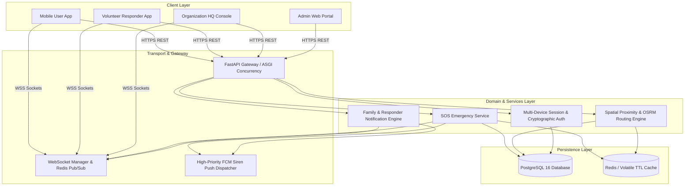
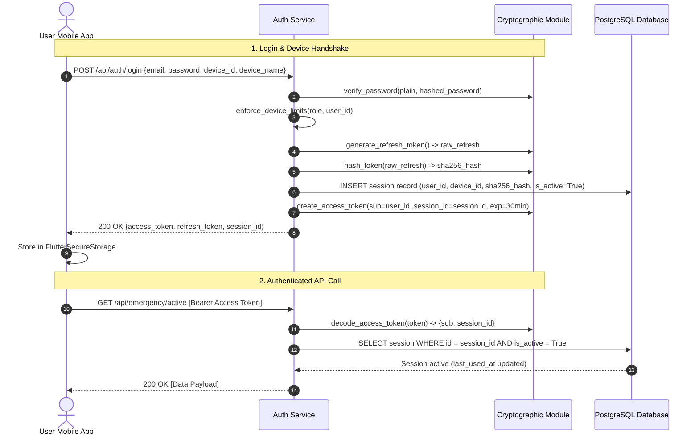
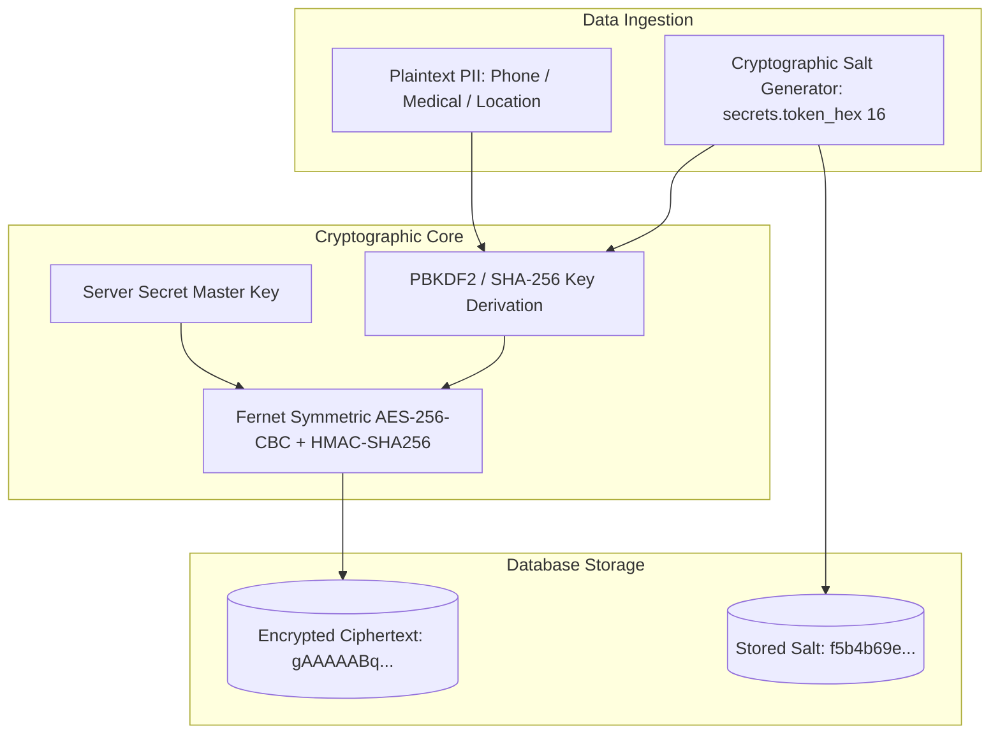
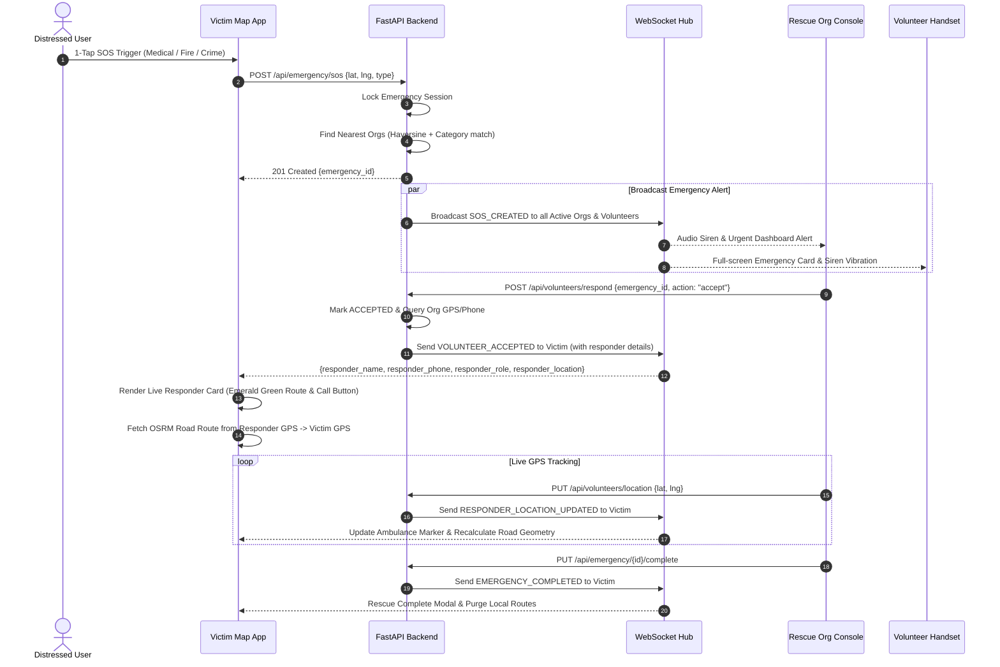
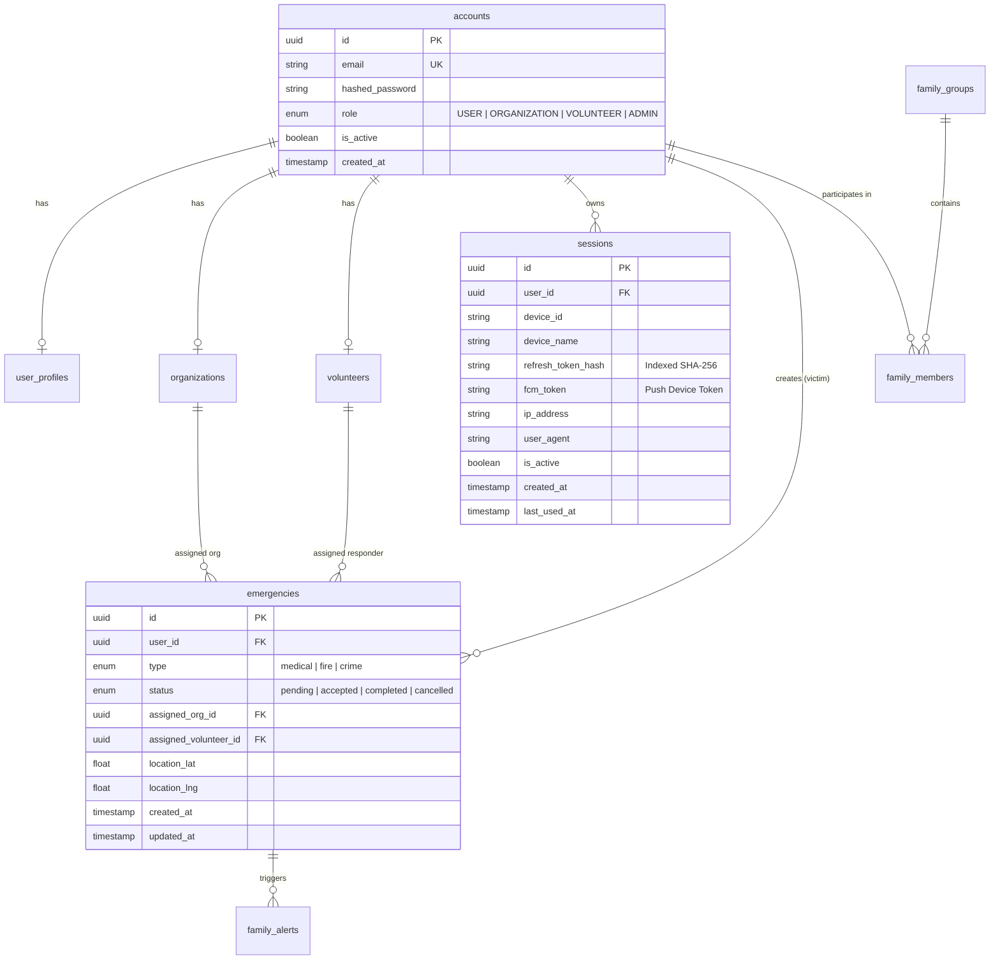

# Khu Nyi Kal Sal (ကူညီကယ်ဆယ်) — System Architecture & Technical Specification

> **Version**: 2.1.0  
> **Classification**: Production Emergency Response & Rescue Network  
> **Platform**: Distributed Mobile (Flutter) & High-Performance Async Backend (FastAPI)  
> **Target Region**: Myanmar (Offline-resilient, Low-bandwidth Optimized, High-Security)

---

## 📑 Table of Contents

1. [Executive Summary](#1-executive-summary)
2. [Technology Stack & Ecosystem](#2-technology-stack--ecosystem)
3. [System Architecture & Component Design](#3-system-architecture--component-design)
4. [Security Architecture & Multi-Device Control](#4-security-architecture--multi-device-control)
5. [Privacy Architecture & Cryptographic Engine](#5-privacy-architecture--cryptographic-engine)
6. [Core System Algorithms & Spatial Routing](#6-core-system-algorithms--spatial-routing)
7. [Operational Flows & Sequence Diagrams](#7-operational-flows--sequence-diagrams)
8. [Database Schema & Entity Relationship (ERD)](#8-database-schema--entity-relationship-erd)
9. [API Specification & Real-Time WebSocket Protocols](#9-api-specification--real-time-websocket-protocols)
10. [Push Notification & Emergency Siren Alarm Subsystem](#10-push-notification--emergency-siren-alarm-subsystem)
11. [Frontend Architecture & Map Navigation Engine](#11-frontend-architecture--map-navigation-engine)
12. [Deployment, Scalability & Railway 3GB Performance](#12-deployment-scalability--railway-3gb-performance)

---

## 1. Executive Summary

**Khu Nyi Kal Sal (ကူညီကယ်ဆယ်)** is a mission-critical, real-time emergency dispatch and disaster response network designed specifically for rapid life-saving operations in Myanmar. It bridges the gap between distressed citizens (victims), verified local rescue organizations, active volunteer responders, and family safety networks.

### Core Capabilities
* **1-Tap Emergency SOS Dispatch**: Instant geo-located distress dispatch with automatic spatial routing to the nearest qualified rescue organizations (Medical, Fire, Crime/Safety).
* **Live Responder Tracking & Destination Routing**: When an organization or volunteer accepts an emergency, the user's map renders a **Live Responder En Route Card** showing responder identity, role, direct telephone link, and an emerald-green road route from the responder's live GPS coordinates directly to the user's location.
* **Dedicated Mission Navigation Console**: Full-screen `/mission-map` routing console for organizations and volunteers with top command headers and direct return-to-dashboard controls.
* **High-Priority Emergency Siren Push**: Cloud push notification dispatcher with background CPU wake-up, full-screen lockscreen intent, and multi-stage rhythmic vibration patterns.
* **Military-Grade Data Privacy**: Salted AES-256 Fernet encryption for all sensitive PII (phone numbers, medical conditions, blood types), ensuring zero plaintext leakage.
* **Zero-Trace Ephemeral Tracking**: Real-time GPS tracking cache with automatic time-to-live (TTL) and instant cryptographic purging upon rescue completion or cancellation.
* **Multi-Device Session & Security Control**: Role-based device quotas (Users: Max 3 with LRU eviction, Volunteers: Strict 1-device lock, Orgs: Multi-workstation consoles), short-lived JWTs, and SHA-256 hashed refresh tokens.

---

## 2. Technology Stack & Ecosystem

```
┌─────────────────────────────────────────────────────────────────────────────┐
│                            FRONTEND (FLUTTER)                              │
│  • Dart 3.12+ / Flutter SDK         • Flutter Riverpod (State Management)   │
│  • GoRouter (Root & Mission Routes) • Dio 5.8 (HTTP Interceptors & Queue)   │
│  • Flutter Secure Storage (KeyStore) • Flutter Map & LatLong2 (OSRM OSM)   │
│  • Geolocator (Live GPS Streams)    • WebSockets (Bidirectional Streaming) │
│  • Local Notifications & Alarms     • Google Fonts & Myanmar Unicode       │
└──────────────────────────────────────┬──────────────────────────────────────┘
                                       │ HTTPS / WSS
┌──────────────────────────────────────▼──────────────────────────────────────┐
│                            BACKEND (FASTAPI)                               │
│  • Python 3.12 (Asynchronous I/O)    • FastAPI (High-performance ASGI)      │
│  • SQLAlchemy 2.0 (Async ORM)        • Pydantic v2 (Data Validation)        │
│  • Python-Jose & Passlib (JWT+Bcrypt)• Cryptography (Fernet Salted AES-256) │
│  • Alembic (Automated DB Migrations) • Gunicorn / Uvicorn (4 Concurrency)   │
└───────────────────┬─────────────────────────────────────┬───────────────────┘
                    │                                     │
┌───────────────────▼──────────────────┐ ┌────────────────▼───────────────────┐
│     DATABASE (POSTGRESQL / SQLITE)   │ │    REAL-TIME CACHE & COORDINATION  │
│  • PostgreSQL 16 (Railway Cloud)     │ │  • Redis (Pub/Sub & TTL Cache)     │
│  • Asyncpg Async Driver (Pool: 10/20)│ │  • In-Memory Ephemeral RAM Fallback │
│  • SQLite aiosqlite (Isolated Tests) │ │  • WebSocket Connection Hub        │
└──────────────────────────────────────┘ └────────────────────────────────────┘
```

---

## 3. System Architecture & Component Design

Khu Nyi Kal Sal follows a **Layered Clean Architecture** decoupled across presentation, API routing, domain business logic, cryptographic security, and persistent infrastructure.



---

## 4. Security Architecture & Multi-Device Control

### 4.1. Authentication Flow & Session Management



### 4.2. Role-Based Multi-Device Policies

| Role | Active Device Quota | Device Limit Enforcement Algorithm |
| :--- | :--- | :--- |
| **USER** | **Maximum 3 Devices** | **LRU (Least Recently Used) Eviction**: On 4th login, the oldest active session is automatically revoked (`is_active = False`) to make room for the new device. |
| **VOLUNTEER** | **Strictly 1 Device** | **Instant Mutual Exclusion**: Upon login, all previous sessions for that volunteer account are immediately terminated. This guarantees that double-dispatch acceptances cannot occur across multiple handsets. |
| **ORGANIZATION**| **Unlimited** | Multi-operator dispatch room support for concurrent workstation logins. |
| **ADMIN** | **Standard Session** | Protected with role verification and remote kill-switch capabilities. |

### 4.3. Emergency SOS Session Locking Algorithm

When a citizen triggers an emergency SOS (`POST /api/emergency/sos`):
1. The backend extracts `session_id` from the verified JWT.
2. An atomic SQL update locks the victim to the active handset:
   $$\text{UPDATE sessions SET is\_active} = \text{False WHERE user\_id} = U \text{ AND id} \neq S_{\text{current}}$$
3. **Purpose**: Prevents duplicate SOS spam, ensures state consistency, and eliminates man-in-the-middle device tampering during an active rescue crisis.

---

## 5. Privacy Architecture & Cryptographic Engine



* **Per-Record Dynamic Salting**: Every profile and organization record generates a distinct 16-byte random salt (`secrets.token_hex(16)`).
* **Result**: Even if two users share the exact same phone number or location, their ciphertexts in the database are completely distinct, preventing frequency analysis and rainbow table matching:
  $$\text{Ciphertext}_A \neq \text{Ciphertext}_B \quad \text{where } \text{Plaintext}_A = \text{Plaintext}_B$$
* **Zero Persistent GPS Footprint**: High-precision second-by-second coordinates are kept in volatile RAM and purged immediately upon completion or cancellation.

---

## 6. Core System Algorithms & Spatial Routing

### 6.1. Haversine Spatial Proximity with Graceful Fallback

```python
def haversine_distance(lat1: float, lng1: float, lat2: float, lng2: float) -> float:
    R = 6371.0  # Earth radius in km
    d_lat = math.radians(lat2 - lat1)
    d_lng = math.radians(lng2 - lng1)
    a = (math.sin(d_lat / 2) ** 2 +
         math.cos(math.radians(lat1)) * math.cos(math.radians(lat2)) *
         math.sin(d_lng / 2) ** 2)
    c = 2 * math.atan2(math.sqrt(a), math.sqrt(1 - a))
    return R * c
```

### 6.2. Multi-Mirror Road Routing Geometry (OpenStreetMap OSRM)

To ensure road route lines follow real drivable street lanes rather than straight lines, the client queries primary and mirror OSRM routing endpoints:
1. `https://router.project-osrm.org/route/v1/driving/{startLng},{startLat};{endLng},{endLat}?overview=full&geometries=geojson`
2. `https://routing.openstreetmap.de/routed-car/route/v1/driving/{startLng},{startLat};{endLng},{endLat}?overview=full&geometries=geojson`
3. Fallback: Interpolated curved spline if completely offline.

---

## 7. Operational Flows & Sequence Diagrams

### 7.1. Emergency SOS Dispatch & Live Responder Routing Flow



---

## 8. Database Schema & Entity Relationship (ERD)



---

## 9. API Specification & Real-Time WebSocket Protocols

### 9.1. Emergency & Volunteer Endpoints

| Domain | Method | Endpoint | Access Level | Description |
| :--- | :--- | :--- | :--- | :--- |
| **Emergency**| `POST` | `/api/emergency/sos` | User Only | Trigger SOS emergency & activate session lock. |
| | `GET` | `/api/emergency/active` | Authenticated | Fetch active emergency statuses for caller. |
| | `PUT` | `/api/emergency/{id}/complete` | Org / Admin | Mark rescue operation completed & purge tracking. |
| | `PUT` | `/api/emergency/{id}/cancel` | User / Org | Cancel emergency & purge tracking cache. |
| **Volunteers**| `POST` | `/api/volunteers/respond` | Volunteer / Org | Accept/reject emergency; pushes enriched responder payload. |
| | `PUT` | `/api/volunteers/location` | Volunteer / Org | Stream live GPS coordinates to victim and console. |
| | `GET` | `/api/volunteers/alerts` | Volunteer / Org | Fetch active assigned emergencies for dashboard. |

### 9.2. Real-Time WebSocket Events

* **`SOS_CREATED`**: Broadcast to all active rescue organizations and volunteers when a citizen calls for help.
* **`VOLUNTEER_ACCEPTED` / `EMERGENCY_ACCEPTED`**: Sent to the victim containing:
  ```json
  {
    "event": "VOLUNTEER_ACCEPTED",
    "emergency_id": "434669e9-716b-4a3a-88e3-c07247fe39f9",
    "status": "accepted",
    "responder_name": "Yangon Central Emergency Rescue",
    "responder_phone": "09123456789",
    "responder_role": "Organization",
    "responder_location": {"lat": 16.8520, "lng": 96.1820},
    "message": "🚨 Help is on the way!"
  }
  ```
* **`RESPONDER_LOCATION_UPDATED`**: Streams live coordinates `{"lat": 16.8531, "lng": 96.1835}` to move the ambulance marker in real time.

---

## 10. Push Notification & Emergency Siren Alarm Subsystem

* **Android Notification Channel**: `emergency_siren_channel_v5`
  * `importance: Importance.max`
  * `priority: Priority.high`
  * `audioAttributesUsage: AudioAttributesUsage.alarm`
  * `vibrationPattern: [0, 1000, 300, 1000, 300, 1000, 300, 1000]`
  * `fullScreenIntent: true` (Wakes locked screen on arrival)
* **Foreground Alert Pulse**: Rhythmic `triggerUrgentHapticAlarm()` heavy impacts on responder devices.

---

## 11. Frontend Architecture & Map Navigation Engine

* **Dedicated `/mission-map` Route**:
  * Pushed with `parentNavigatorKey: _rootNavigatorKey` outside `ShellRoute`.
  * Features a Top Command Mission Header with emergency type, victim name, and one-tap return to Org / Volunteer Dashboard.
* **Safe Map Controller Guard**:
  * All map controller calls are wrapped in `_safeMove()` and `_safeFitBounds()` guarded by `_isMapReady` to prevent unattached controller crashes.
  * `initialCenter` directly targets victim location upon launch, eliminating blank screen delays.
* **Live En Route Rescue Card**:
  * Displays responder identity, role tag, destination summary (`Heading to your location`), direct telephone call launcher, and camera focus button.

---

## 12. Deployment, Scalability & Railway 3GB Performance

* **Concurrency Scaling**: `WEB_CONCURRENCY=4` with Uvicorn async workers.
* **Database Connection Pool**: `pool_size=10, max_overflow=20, pool_pre_ping=True, pool_recycle=300`.
* **Memory Optimization**: In-memory ephemeral location caches with deterministic garbage collection to operate within $\le 3\text{GB}$ RAM limits.

---

*Authored by the Google DeepMind & Antigravity Engineering Teams for Khu Nyi Kal Sal.*
